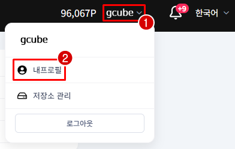
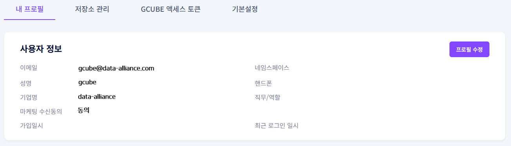
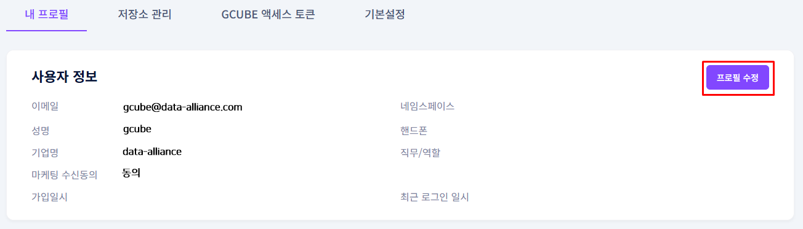
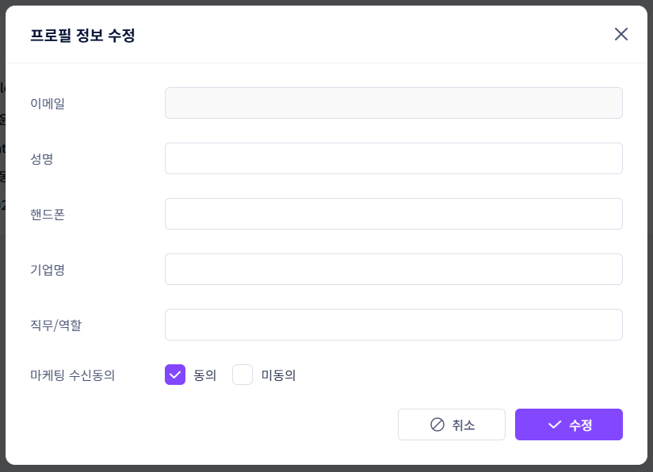

# **프로필 설정**

계정의 이름, 연락처 등 기본 정보를 설정합니다.

!!! tip
    프로필 설정은 내 프로필 메뉴에서 언제든지 수정할 수 있습니다.

## **프로필 설정 방법**

1. 화면 우측 상단 이름 옆 화살표를 클릭한 후 내 프로필을 클릭합니다.

1. 사용자 정보 화면에서 현재 계정 정보를 확인합니다.

1. 프로필 수정 버튼을 클릭합니다.

1. 수정 팝업에서 원하는 정보를 변경한 후 수정 버튼을 클릭하면 완료됩니다.
