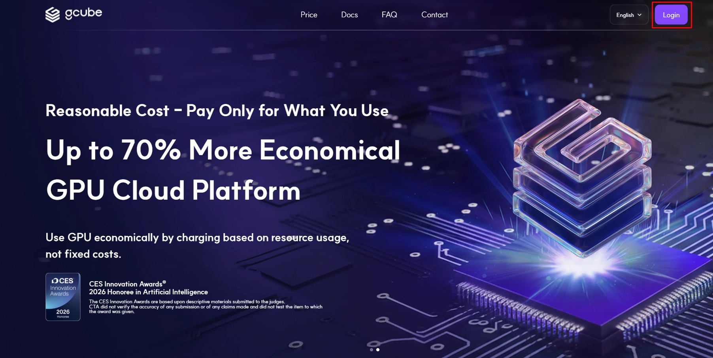
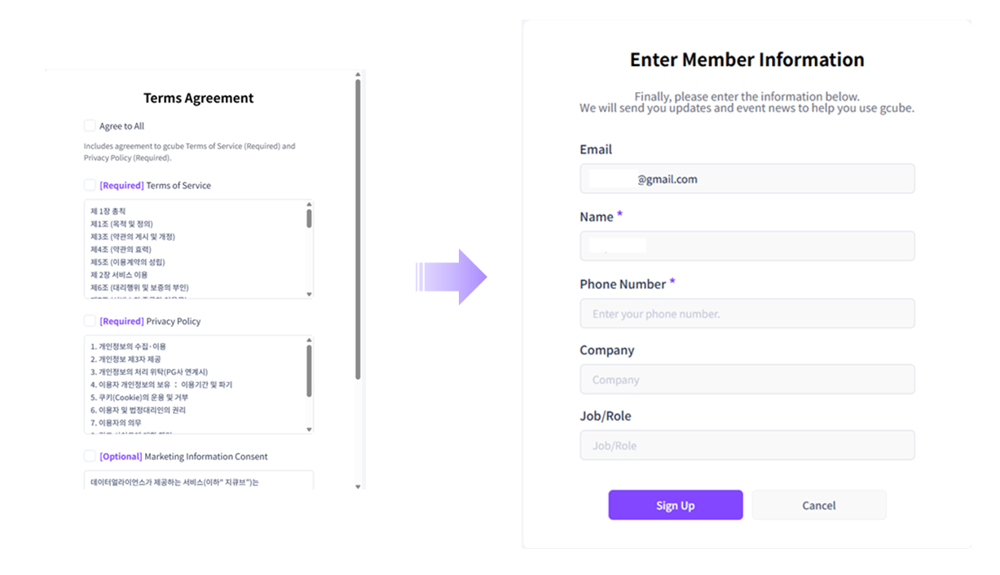

# **Account Creation**

## Sign Up & Login Instructions

1\. Click the **"Login"** button located at the top right corner of the homepage.  

2\. Click the **"Sign Up"** button at the bottom of the login screen.  

3\. Proceed with a simple sign-up using your preferred account: **Google or Microsoft.**  

4\. Select the account you wish to use, **agree to the Terms and Conditions**, and enter your user information to complete the registration.   

5\. Return to the login page and select your registered email account to log in.   

6\. Once logged in, you can access all of gcube’s services.  
Use the **Mode Toggle** button at the top of the left-hand menu to switch between **Workload Deployment Mode** (for users) and **Node Provider Mode** (for suppliers).   

[Go to GCUBE Login Page](https://gcube.ai/en/index)