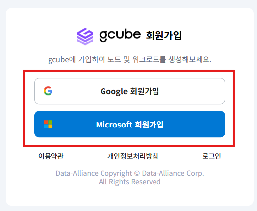
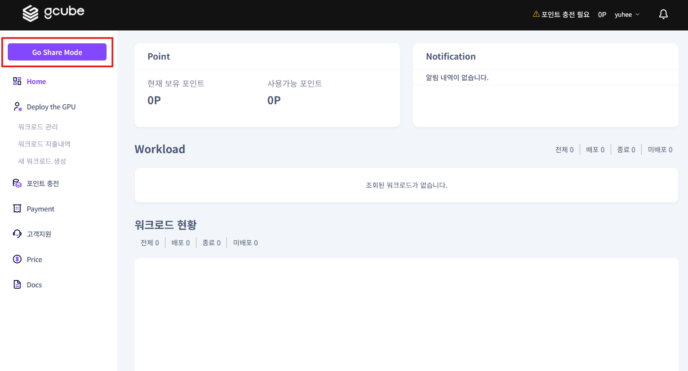

# **계정생성**

## 회원가입&로그인

1\. 홈페이지 우측 상단의 “**로그인**” 버튼을 클릭하세요.  

2\. 로그인 화면 하단의 **‘회원가입’** 버튼을 클릭하세요.  

3\. **구글 / 마이크로소프트** 중 원하는 계정으로 간편 회원가입을 진행합니다.  

4\. 사용하실 계정을 선택하신 후, **약관동의**를 진행하신 다음 회원 정보를 입력하여 **회원가입**을 완료합니다.   

5\. 로그인 페이지로 이동하여 가입한 이메일 계정을 선택하여 로그인합니다.   

6\. 로그인 후, gcube의 모든 서비스를 이용하실 수 있습니다.  
좌측 메뉴 상단 모드 변경 버튼을 통해 워크로드 배포 모드와 노드 공급모드를 전환할 수 있습니다.   

[GCUBE 로그인 바로가기](https://console.gcube.ai/)