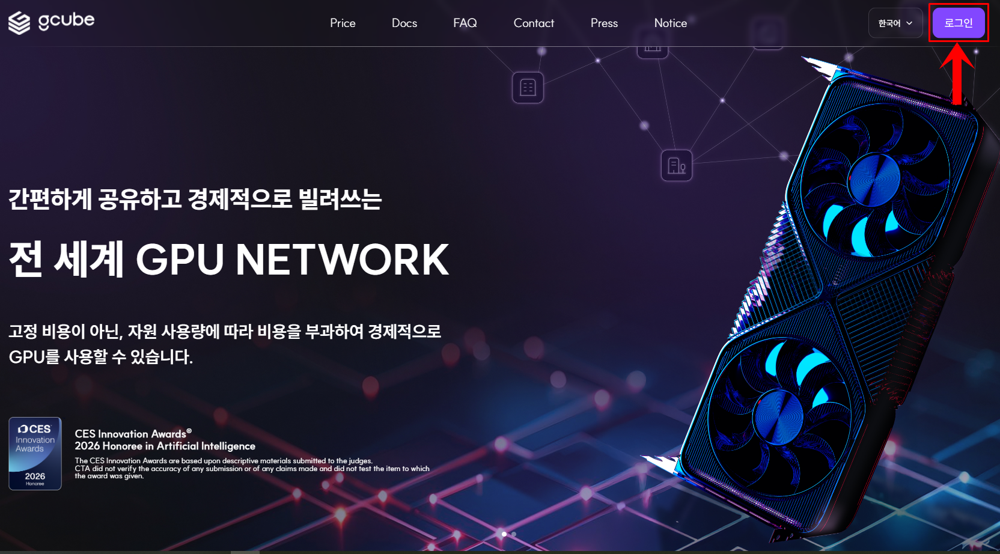
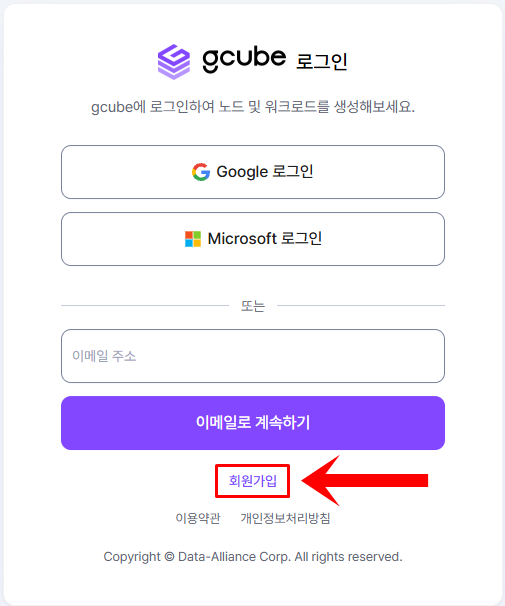
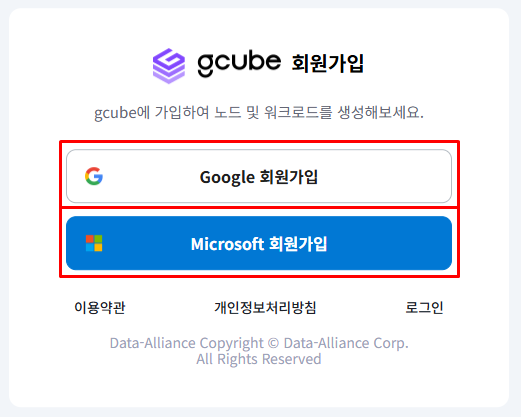
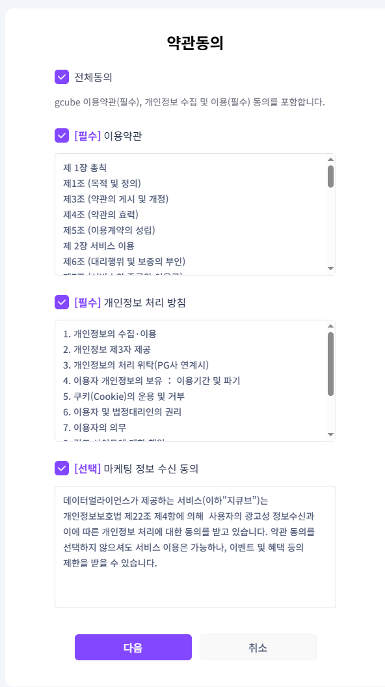
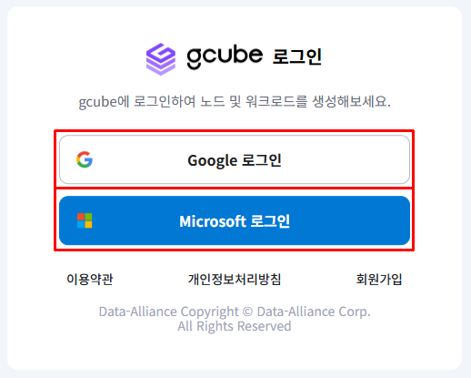
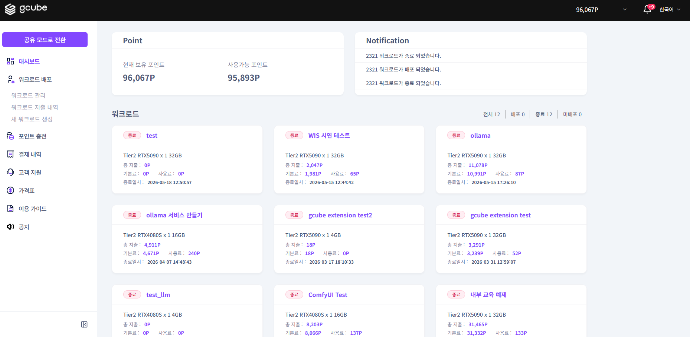

# **계정 만들기**

!!! tip
    gcube 서비스를 이용하려면 먼저 계정을 생성하세요.
    구글 또는 마이크로소프트 계정으로 간편하게 가입할 수 있습니다.  
    별도의 비밀번호 설정이 필요 없습니다.

## **시작 전 확인사항**

- **구글 계정 또는 마이크로소프트 계정 중 하나가 필요합니다.**
- 모바일 브라우저보다 **PC 브라우저**를 권장합니다.

---

## **회원가입 방법**

1. **gcube 홈페이지** 우측 상단의 **로그인 버튼**을 클릭합니다.

2. 로그인 화면 하단의 **회원가입 버튼**을 클릭합니다.

3. **구글 또는 마이크로소프트 계정**을 선택합니다.

4. 사용할 계정을 선택하고 약관에 동의한 뒤, 회원 정보를 입력해 가입을 완료합니다.

---

## **로그인 방법**

1. 로그인 페이지에서 가입에 사용한 계정을 선택합니다.

2. 로그인 완료 후 gcube 콘솔로 이동합니다.

!!! success
    로그인 후 좌측 메뉴 상단의 모드 변경 버튼으로 공급자(Share Mode)와 소비자(Workload Mode)를 전환할 수 있습니다.