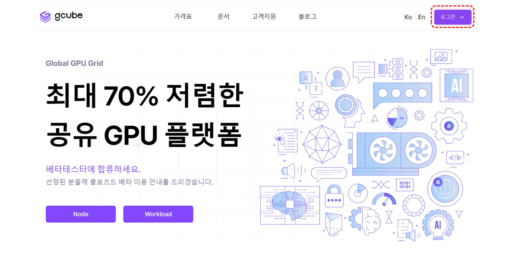
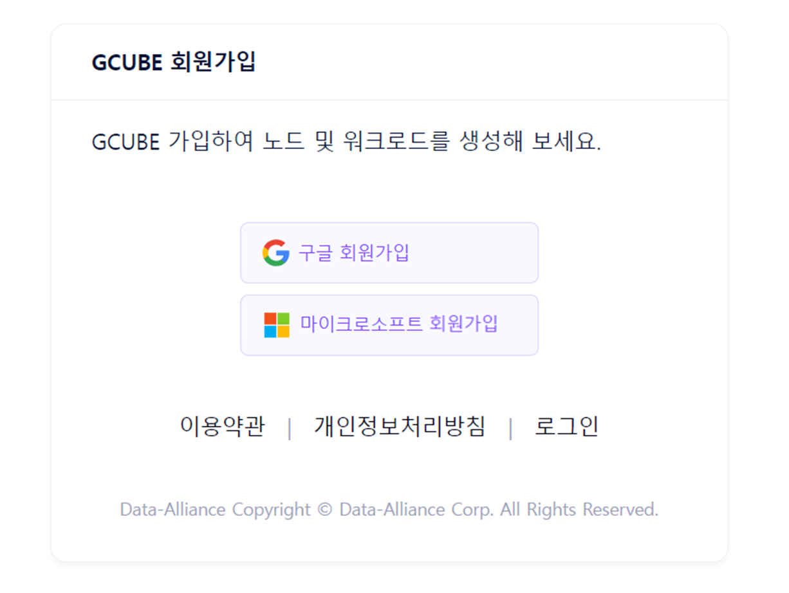
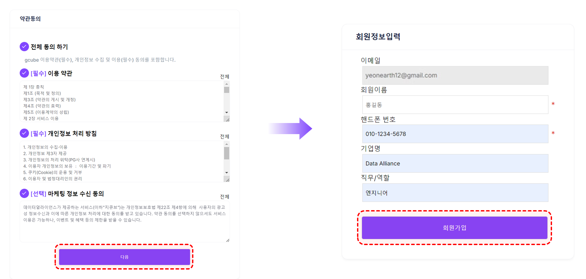
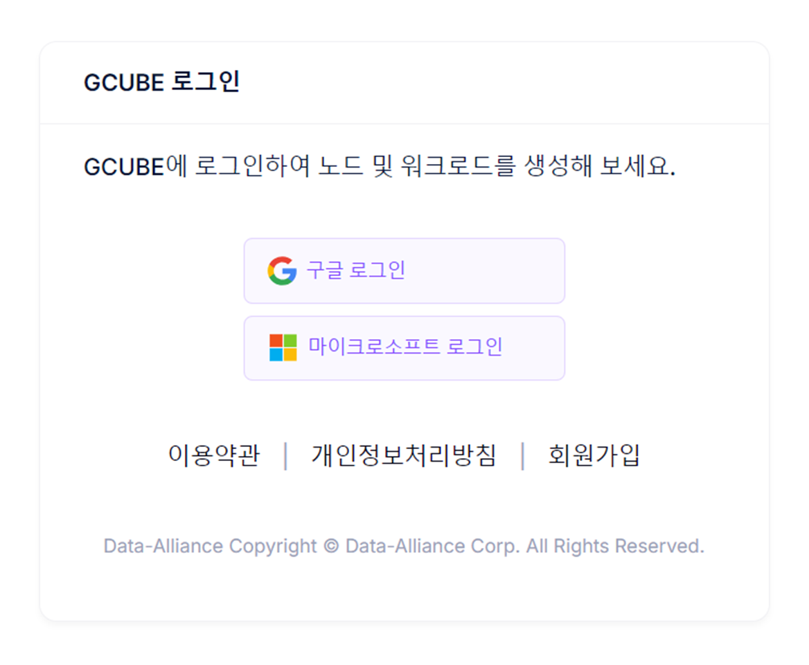
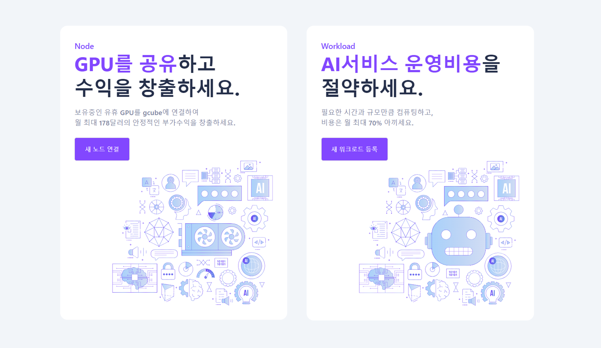

# 계정생성

## 회원가입&로그인

1\. 홈페이지 우측 상단의 “**로그인**” 버튼을 클릭하세요.

2\. **구글 / 마이크로소프트** 중 원하는 계정으로 간편 회원가입을 진행합니다.

3\. **약관동의** 후, 회원 정보를 입력하여 **회원가입**을 완료합니다.

4\. 로그인 페이지로 이동하여 가입한 이메일 계정을 선택하여 로그인합니다.

5\. 로그인 후, gcube의 모든 서비스를 이용하실 수 있습니다.

[gcube 로그인 바로가기](https://console.gcube.ai/auth/signin)
