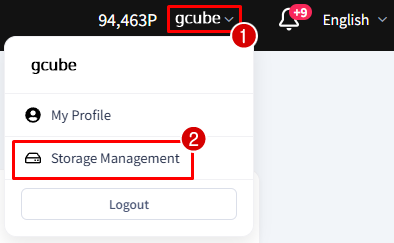
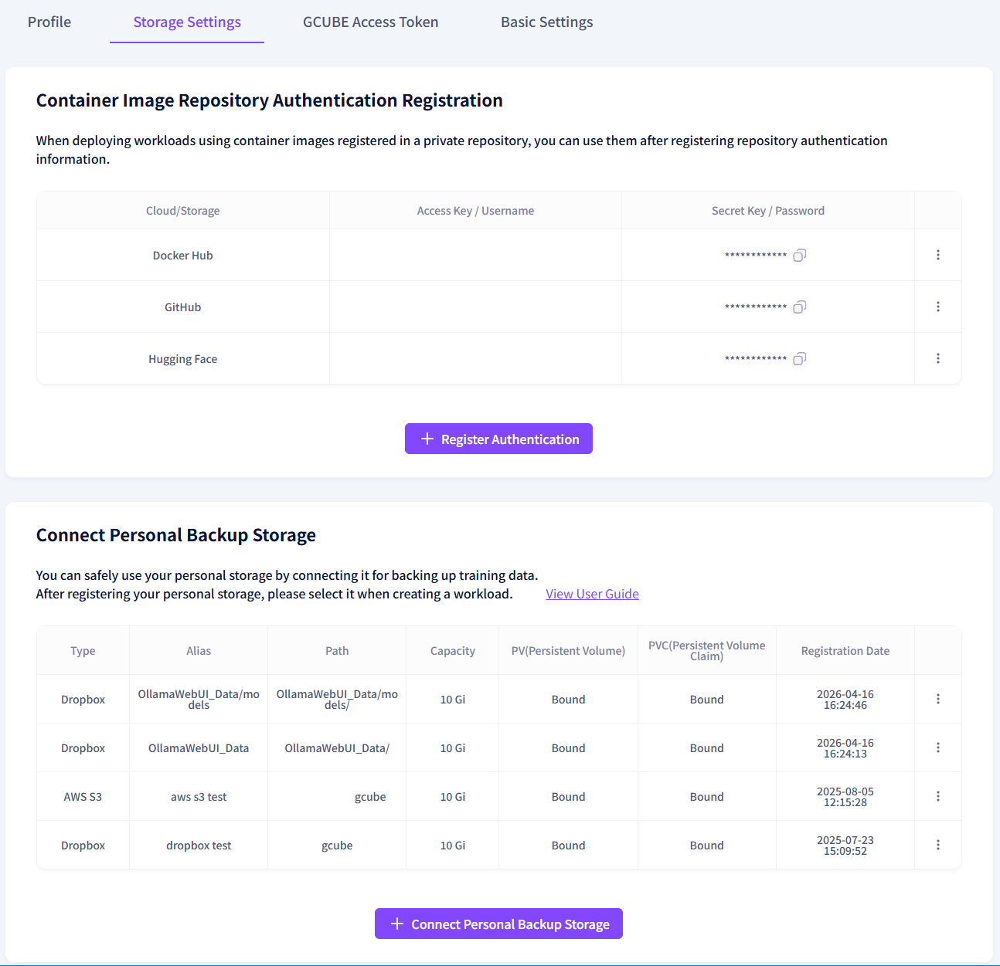
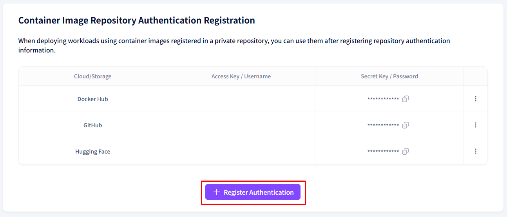
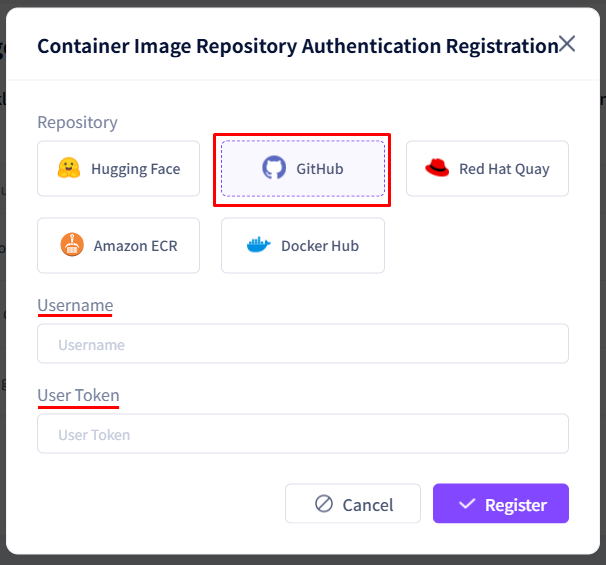
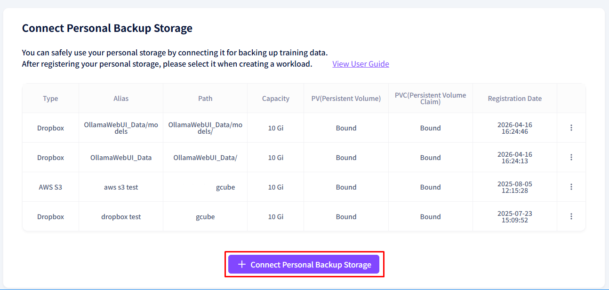
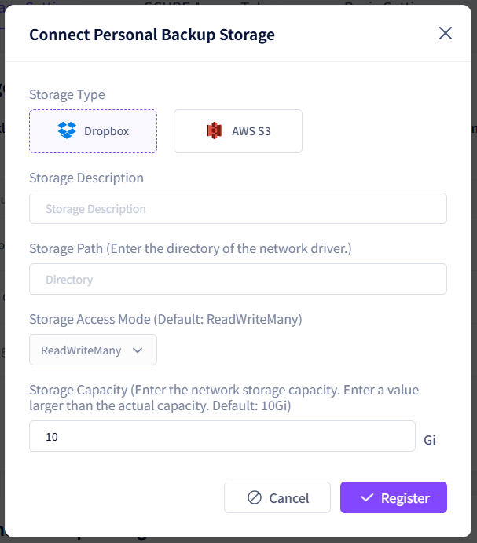
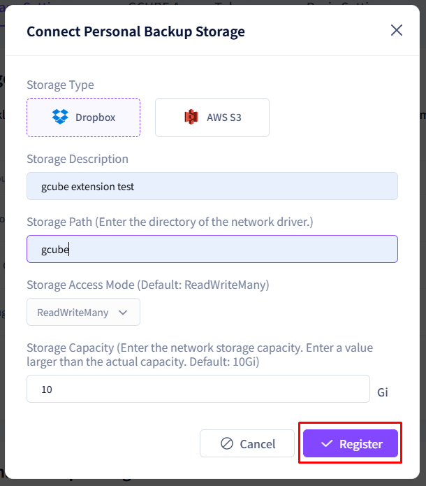

# **Storage Management**

Set up container image registry credentials and personal backup storage.

!!! tip
    Two settings are available in Storage Management:
    [Container Image Registry Credential Registration] [Personal Backup Storage Connection]

## **How to Access Storage Management**

1. Click the arrow next to your name in the upper right corner, then click Storage Management.

2. Two sections will be displayed: Container Image Registry Credential Registration and Personal Backup Storage Connection.

## **Container Image Registry Credential Registration**

To use container images from a private registry in your workload, you must register the credentials first.

1. Click the **+ Register Credential** button.

2. Select the registry provider and enter the required information.

3. Click the Register button to complete.

Registered credentials can be updated using the Edit button.

## **Personal Backup Storage Connection**

To preserve data when a workload is terminated, connect a personal storage service (Dropbox, AWS S3, etc.).

1. Click the **+ Connect Personal Backup Storage** button.

2. Select the type and storage provider.

3. Enter the required credentials.

    | **Storage** | **Required Information** |
    | --- | --- |
    | Dropbox | Dropbox account authentication (OAuth) |
    | AWS S3 | IAM Access Key, Secret Access Key, Bucket Region |

4. Set the storage description and the mount path inside the container.

    Example: /data/data → The path where the storage is mounted inside the container.  Files can be read and written at this location.

5. Click the Register button to complete.

!!! warning
    When registering a workload, make sure to select this storage under the Personal Storage field so that data is actually backed up.

---

[Next: Provider or Consumer? →](provider-vs-consumer.en.md){ .md-button .md-button--primary }

