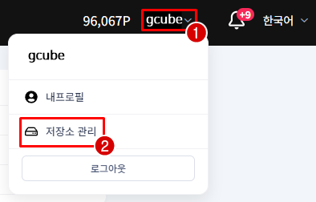
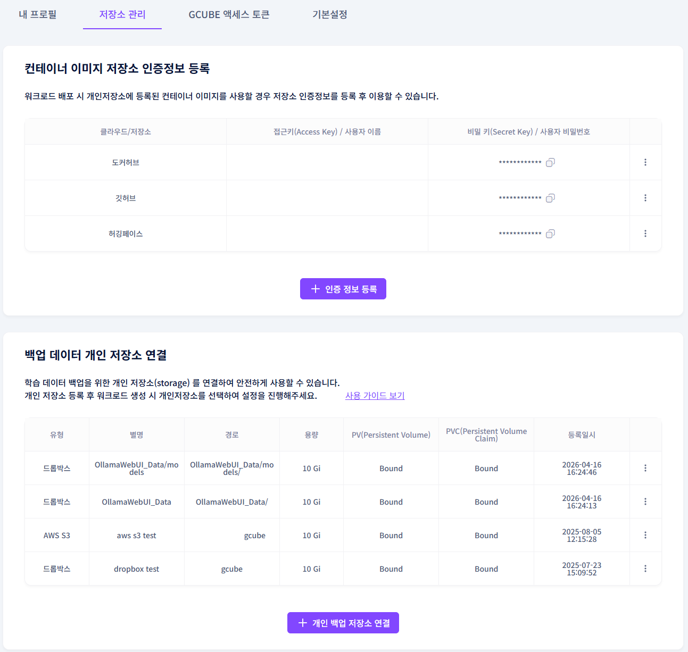
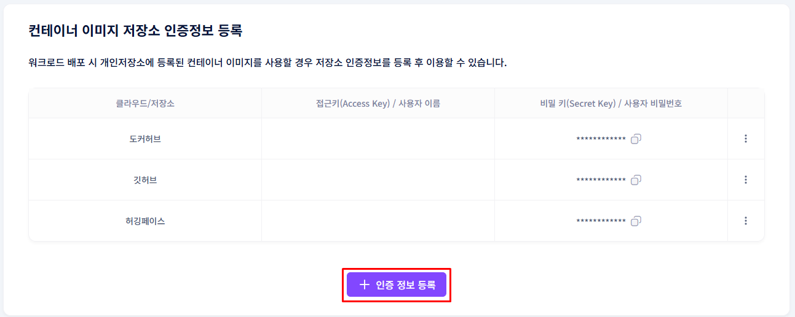
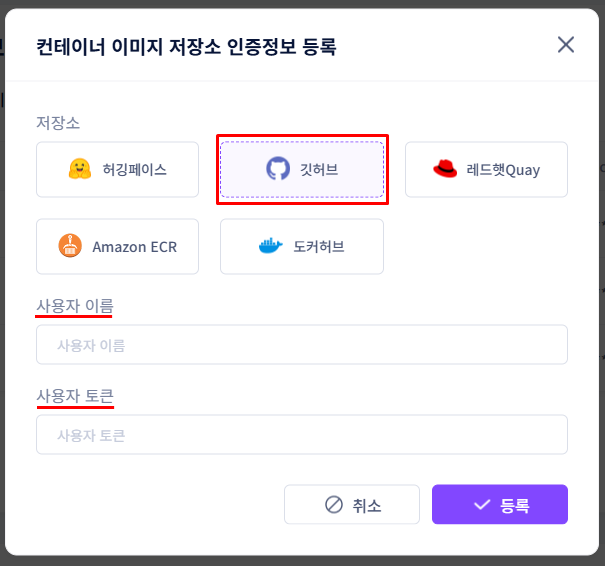
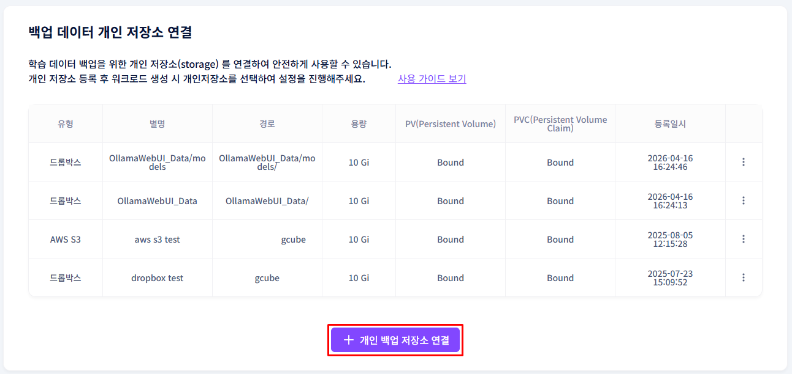
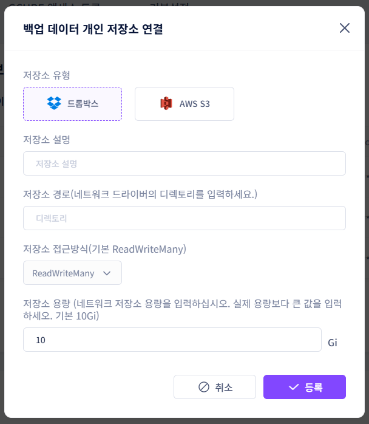
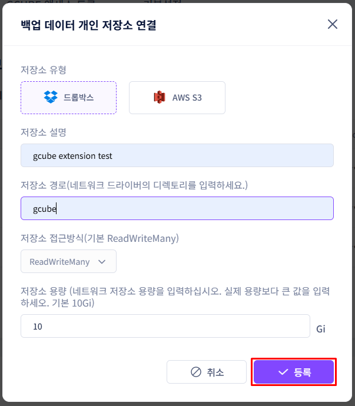

# **저장소 관리**

컨테이너 이미지 저장소 인증과 개인 백업 저장소를 설정합니다.

!!! tip
    저장소 관리에서 두 가지를 설정할 수 있습니다: 
    [컨테이너 이미지 저장소 인증정보 등록] [백업 데이터 개인 저장소 연결]

## **저장소 관리 진입 방법**

1. 화면 우측 상단 이름 옆 화살표를 클릭한 후 저장소 관리를 클릭합니다.

1. 컨테이너 이미지 저장소 인증정보 등록과 백업 데이터 개인 저장소 연결 두 섹션이 표시됩니다.

## **컨테이너 이미지 저장소 인증정보 등록**

개인(프라이빗) 저장소의 컨테이너 이미지를 워크로드에 사용하려면 인증 정보를 먼저 등록해야 합니다.

1. **+ 인증 정보 등록** 버튼을 클릭합니다.

1. 사용할 저장소 제공 업체를 선택하고 필요한 정보를 입력합니다.

2. 등록 버튼을 클릭하면 완료됩니다.

등록된 인증정보는 편집 버튼으로 수정할 수 있습니다.

## **백업 데이터 개인 저장소 연결**

워크로드 종료 시 데이터를 보존하려면 개인 저장소(Dropbox, AWS S3 등)를 연결해야 합니다.

1. **+ 개인 백업 저장소 연결** 버튼을 클릭합니다.

2. 유형을 선택하고 저장소 제공 업체를 선택합니다.

3. 필요한 인증 정보를 입력합니다.

| **저장소** | **필요 정보** |
| --- | --- |
| Dropbox | Dropbox 계정 인증 (OAuth) |
| AWS S3 | IAM Access Key, Secret Access Key, Bucket Region |
1. 저장소 설명과 컨테이너 내부 마운트 경로를 설정합니다.

예: /data/data → 컨테이너 내부에서 저장소가 마운트되는 경로. 이 위치에서 파일을 읽고 쓸 수 있습니다.

1. 등록 버튼을 클릭하면 완료됩니다.

!!! warning
    워크로드 등록 시 개인 Storage 항목에서 이 저장소를 선택해야 실제로 데이터가 백업됩니다.

---

[다음: 공급자 / 소비자 확인 →](provider-vs-consumer.ko.md){ .md-button .md-button--primary }

