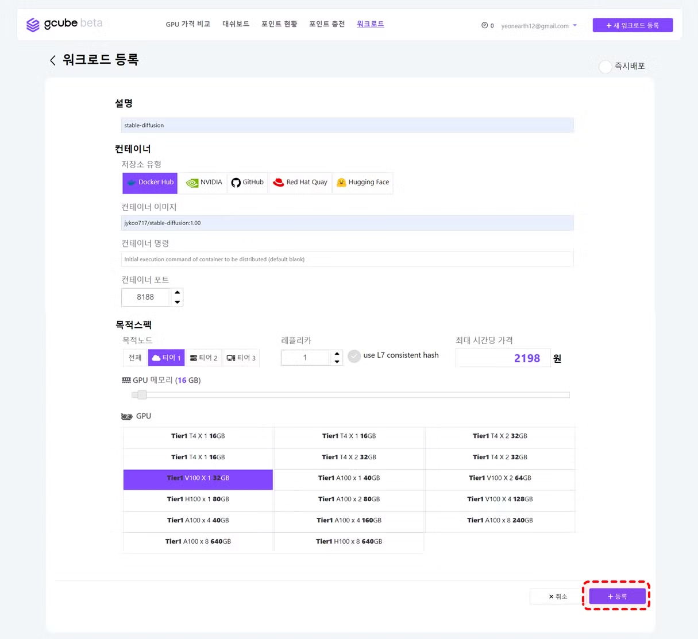
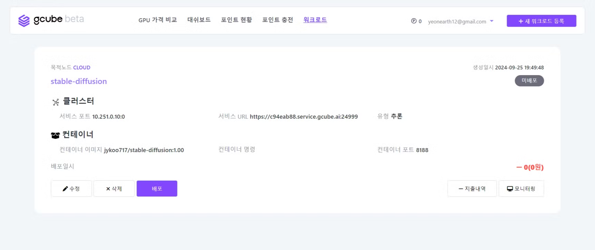
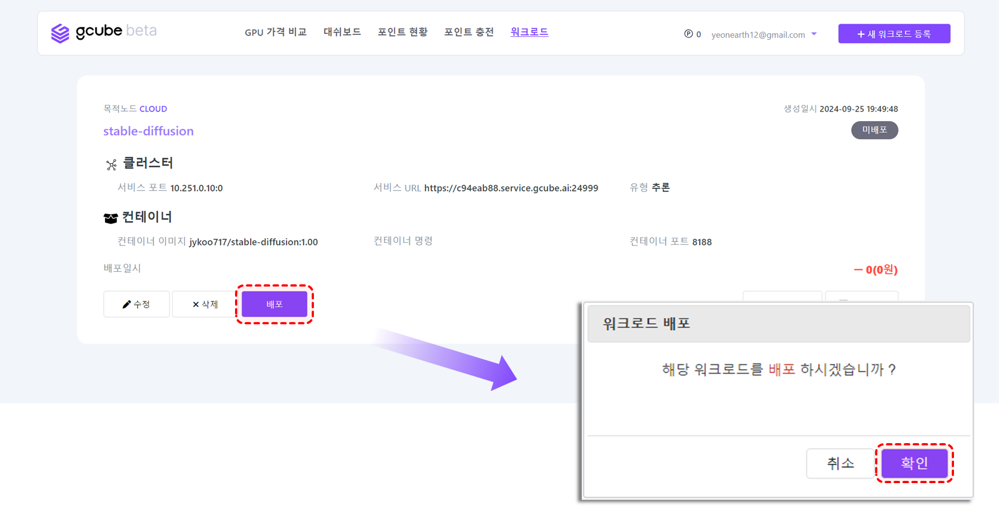
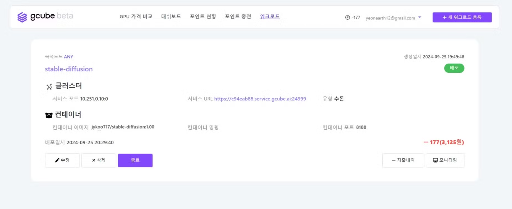
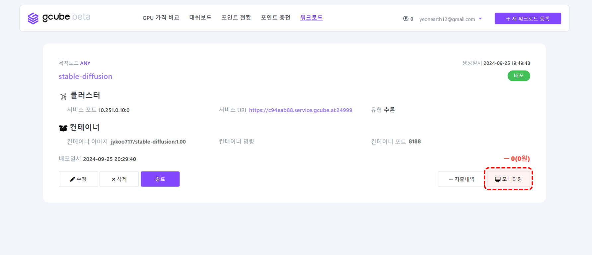
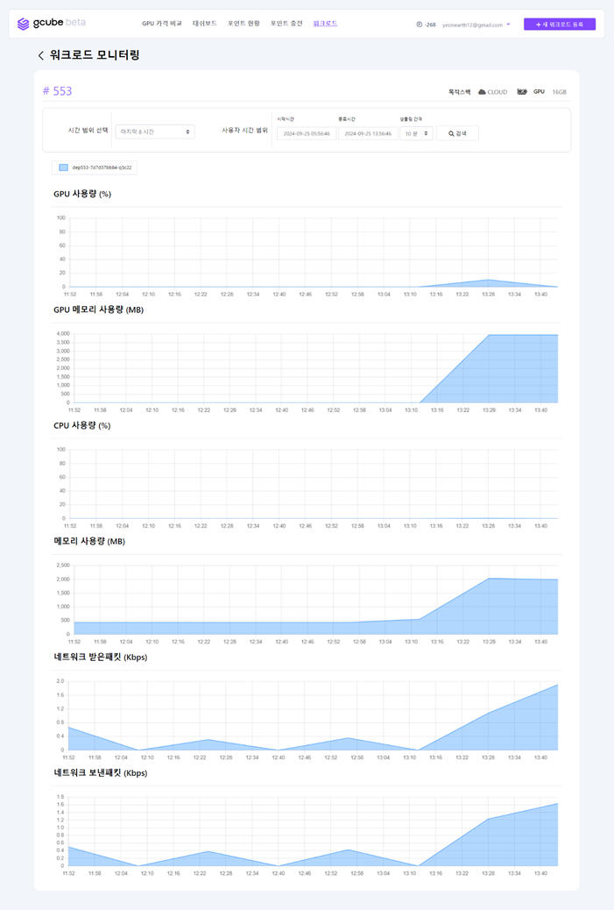
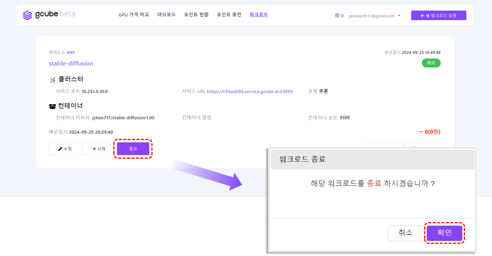
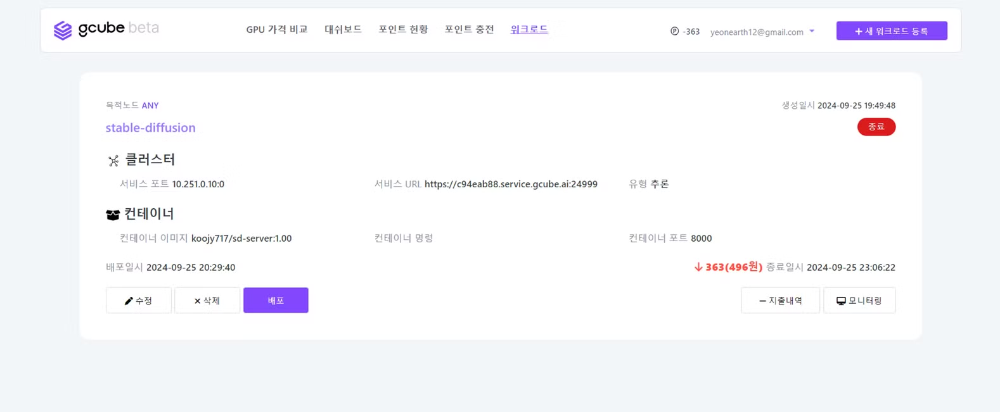

# workload

## 새 워크로드 등록

1. 워크로드 탭에서 “**새 워크로드 등록**” 버튼을 클릭하세요.

2. 워크로드의 정보를 입력한 후, “**등록**” 버튼을 클릭합니다.
- **설명** : 워크로드에 대한 간략한 설명을 작성
- **저장소 유형** : 컨테이너 이미지가 저장된 플랫폼을 선택
- **컨테이너 이미지** : 저장소에 업로드한 컨테이너 이미지 URL을 입력
    *ex) <docker 계정>/stable-diffusion:1.00*
- **컨테이너 명령** : 컨테이너를 실행하기 위한 초기 명령을 입력(필요 시)
    *ex) python3 app.py*
- **컨테이너 포트** : 컨테이너에서 사용하는 네트워크 포트를 입력
- **목적노드** : Tier별 공급 가능한 GPU 리소스 항목이 적용
    *Tier1 : 클라우드 사업자, Tier2 : 전용 서버, Tier3 : PC방, 개인*
- **레플리카** : 배포할 컨테이너 인스턴스의 수를 입력
- **GPU 메모리** : 필요한 GPU 메모리의 양을 조정
- **GPU** : 사용 가능한 GPU 모델 유형을 확인 및 선택

3. 워크로드가 생성되어 목록에서 확인하실 수 있습니다. 

## 워크로드 배포

1. 워크로드에서 배포할 워크로드 항목의 “**배포**” 버튼을 클릭 후, “**확인**” 버튼을 클릭하세요.

2. 우측 상단의 워크로드 상태가 **미배포** → **배포** 상태로 변경되며, **서비스 URL**이 활성화 되는 것을 확인하실 수 있습니다. (몇 분정도 시간이 소요될 수 있습니다.)

## 워크로드 모니터링

1. 워크로드 항목 우측 하단의 “**모니터링**” 버튼을 클릭합니다. 

2. 실시간 모니터링 현황이 출력되며, 아래와 같은 항목을 확인하실 수 있습니다.
- **GPU 사용량 (%)**
- **GPU 메모리 사용량 (MB)**
- **CPU 사용량 (%)**
- **메모리 사용량 (MB)**
- **네트워크 받은 패킷 (Kbps)**
- **네트워크 보낸 패킷 (Kbps)**

## 워크로드 지출내역

1. 워크로드 항목 우측 하단의 “**지출내역**” 버튼을 클릭합니다. 

2. 워크로드 항목에 대한 사용 포인트 및 이용 금액을 확인할 수 있습니다.
    
    **“세부내역”** 버튼을 클릭하면 파드나 이용시간별로 과금된 세부 내역을 확인하실 수 있습니다.
    

## 워크로드 종료

1. 워크로드 종료를 원하신다면, 배포된 항목의 “**종료**” 버튼을 클릭 후, “**확인**” 버튼을 클릭하세요.
    

2. 우측 상단의 워크로드 상태가 **배포** → **종료** 상태로 변경되며, 서비스가 중단됩니다.

!!! Note  
      종료 시, 작업 중이던 데이터 및 환경은 **저장되지 않으니** 유의하시기 바랍니다.   
      (향후 외부 스토리지를 이용하여 저장할 수 있도록 업데이트 할 예정입니다.)
