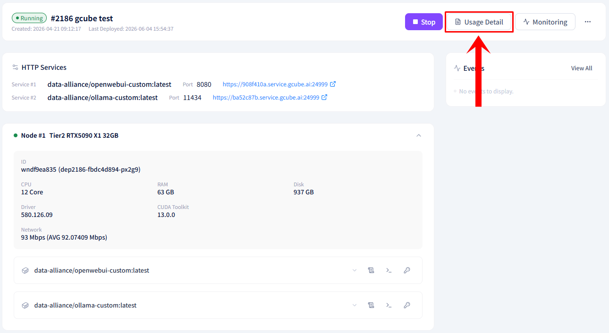
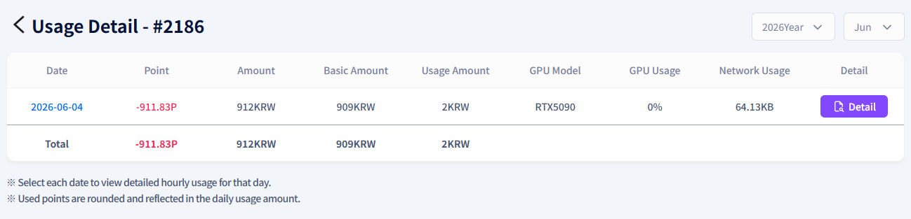
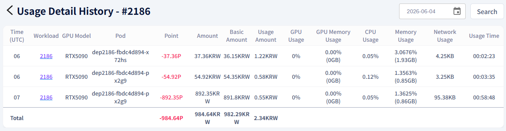

# **Check Usage History**

Check the point deduction history based on workload usage.

!!! tip
    Use the Usage Details feature to view point usage and detailed billing information per workload.

## **How to Check Usage History**

1. Click the Usage Details button at the bottom right of the workload item in the workload list.

2. Check the points used and the usage amount for the workload.

3. If you need a breakdown by pod or by hour, click the Details button.

---

[Next: Terminate Workload →](stop-workload.en.md){ .md-button .md-button--primary }

