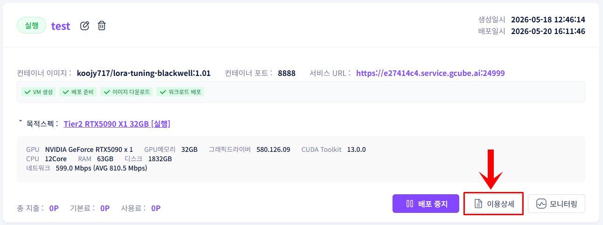
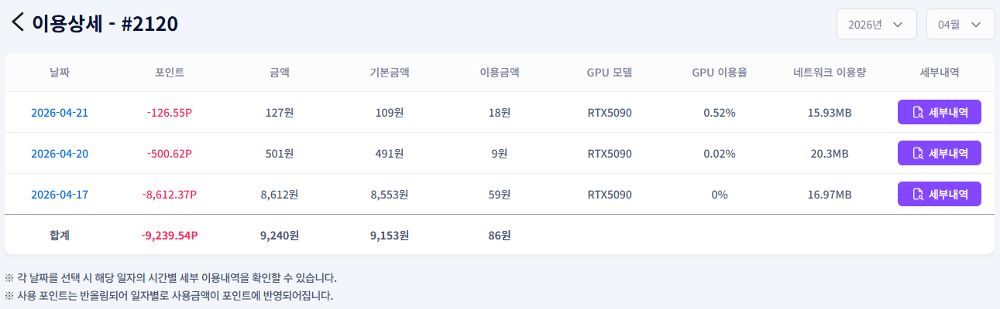
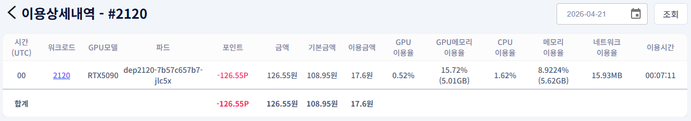

# **이용내역 확인**

워크로드 사용에 따른 포인트 차감 내역을 확인합니다.

!!! tip
    이용상세 기능을 통해 워크로드별 포인트 사용 내역과 세부 과금 정보를 확인할 수 있습니다.

## **이용내역 확인 방법**

1. 워크로드 목록에서 확인할 항목 우측 하단의 이용상세 버튼을 클릭합니다.

1. 해당 워크로드의 사용 포인트 및 이용 금액을 확인합니다.

1. 파드별, 시간별 세부 내역이 필요한 경우 세부내역 버튼을 클릭합니다.

