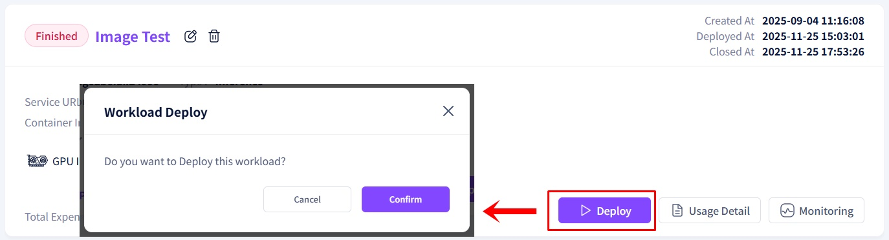
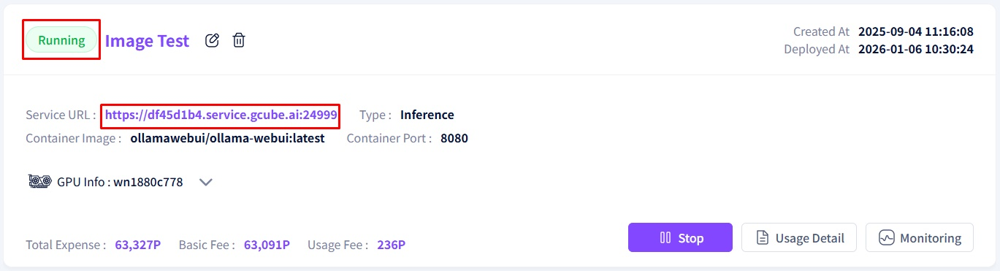

# **Workload Deployment**

Once a workload is registered, you can begin utilizing resources by deploying it.   

1\. Locate the registered workload you wish to deploy and click the **"Deploy"** button. Click the **"Confirm"** button in the pop-up window.   

2\. Observe the workload status in the top-right corner change from **"Finished"** to **"Running."**  
 Once the status changes, the **Service URL** will be activated. (Please note that this process may take several minutes.)