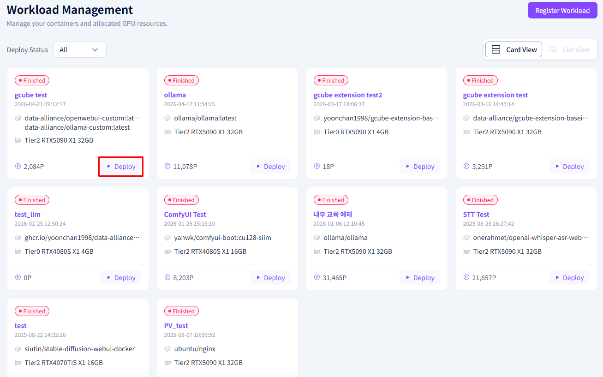
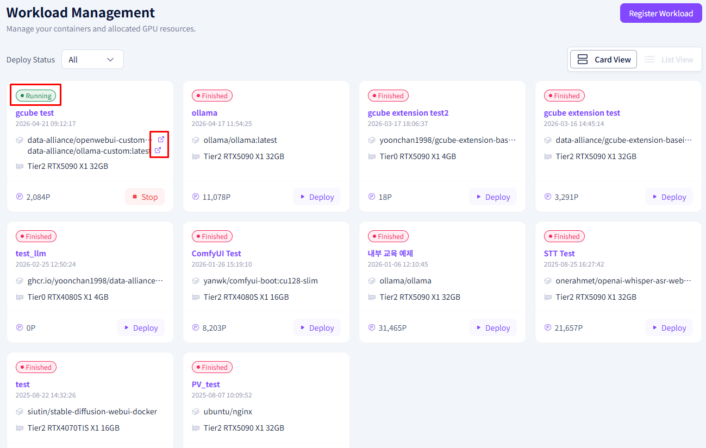

# **Deploy Workload**

Deploy a registered workload to start using GPU resources.

!!! tip
    Once deployment is complete, the service URL will be activated and you can access the workload.
    Deployment may take a few minutes.

## **How to Deploy**

1. Click the Deploy button for the workload you want to deploy in the workload list.

2. Click the Confirm button in the confirmation popup.
3. The workload status will change from Not Deployed → Deployed and the service URL will be activated.

!!! warning
    It may take a few minutes for the status to switch to Deployed. Please wait until the status changes.

## **Deployment Status Types**

| **Status** | **Description** |
| --- | --- |
| Not Deployed | Registered but not yet running |
| Deploying | Preparing after the deploy command |
| Deployed | Running normally, service URL accessible |
| Stopped | Deployment has been stopped |

---

[Next: SSH Terminal Access →](ssh-terminal.en.md){ .md-button .md-button--primary }

