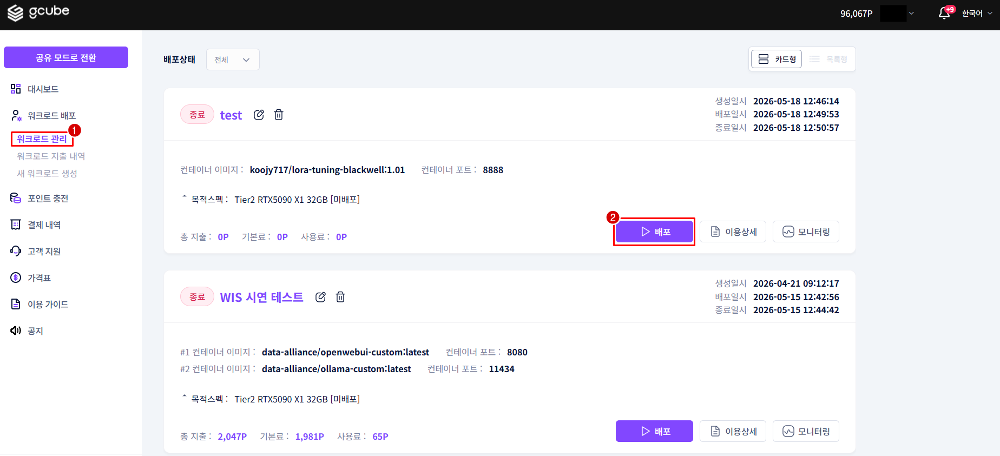
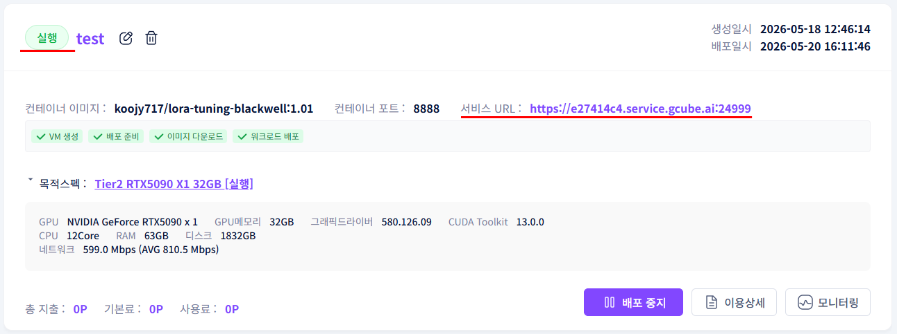

# **워크로드 배포**

등록된 워크로드를 배포해 GPU 자원 사용을 시작합니다.

!!! tip
    배포가 완료되면 서비스 URL이 활성화되어 워크로드에 접속할 수 있습니다. 
    배포에는 수 분이 소요될 수 있습니다.

## **배포 방법**

1. 워크로드 목록에서 배포할 워크로드 항목의 배포 버튼을 클릭합니다.

1. 확인 팝업에서 확인 버튼을 클릭합니다.
2. 워크로드 상태가 미배포 → 배포로 변경되고 서비스 URL이 활성화됩니다.

!!! warning
    배포 상태로 전환되는 데 수 분이 소요될 수 있습니다. 상태가 변경될 때까지 기다려주세요.

## **배포 상태 종류**

| **상태** | **설명** |
| --- | --- |
| 미배포 | 등록은 됐지만 아직 실행되지 않은 상태 |
| 배포 중 | 배포 명령 후 준비 중인 상태 |
| 배포 | 정상 실행 중, 서비스 URL 접속 가능 |
| 종료 | 배포 중지된 상태 |

---

[다음: SSH 터미널 접속 →](ssh-terminal.ko.md){ .md-button .md-button--primary }

