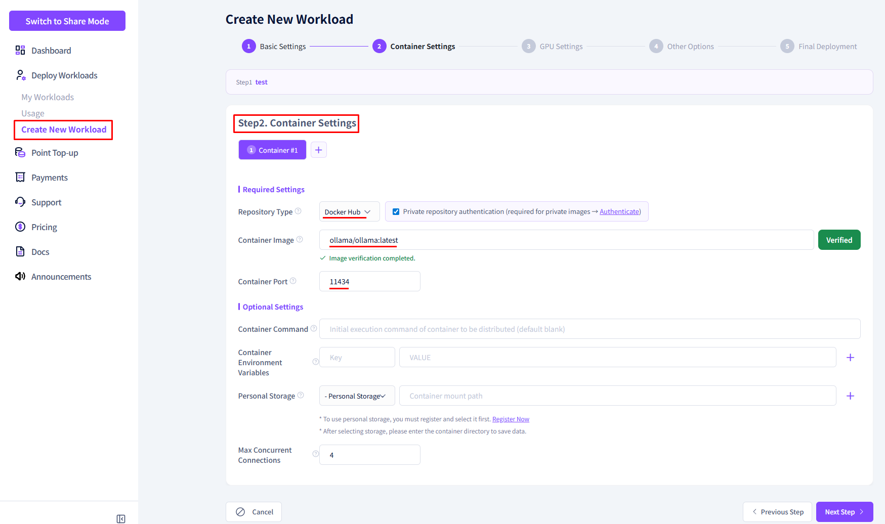
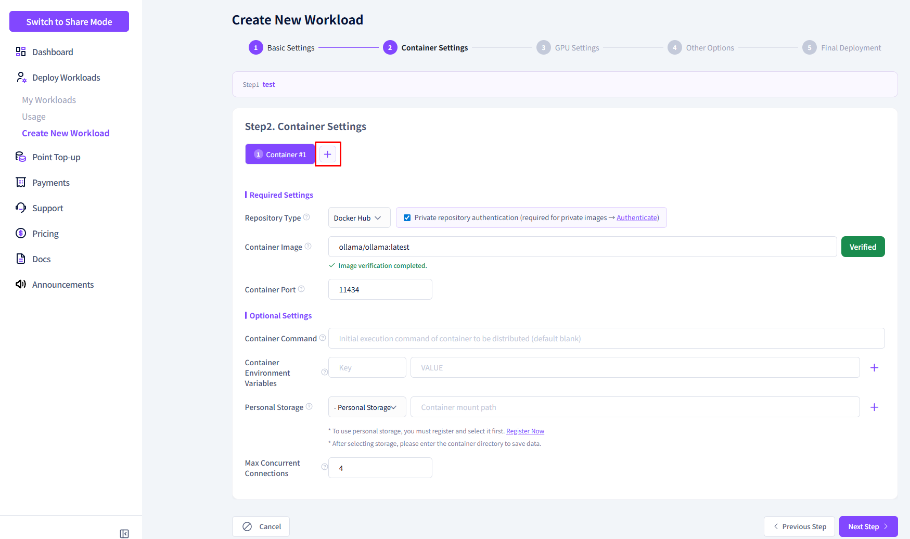
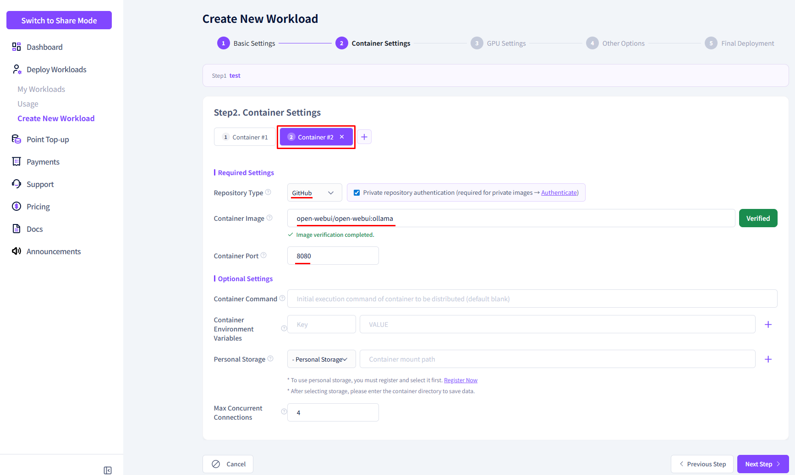
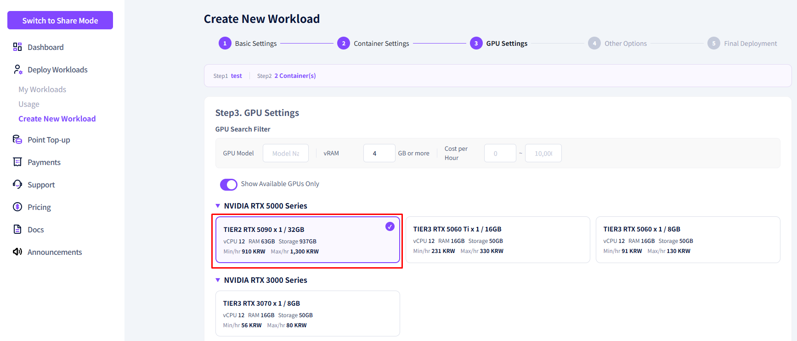
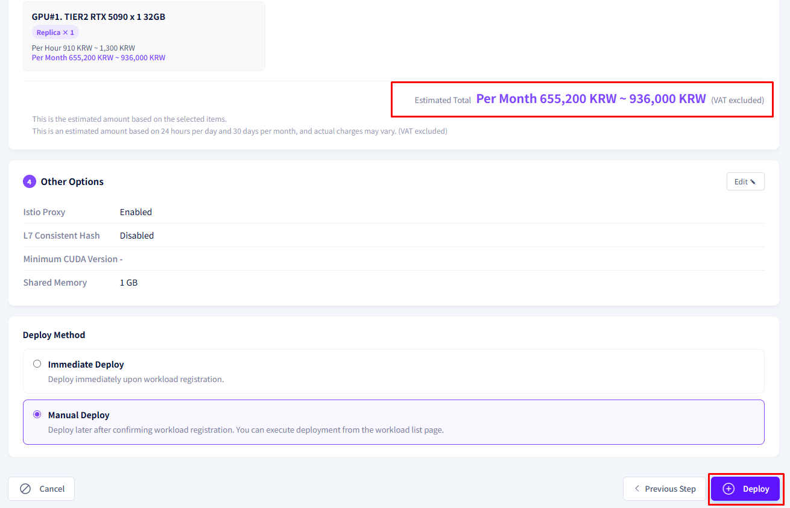
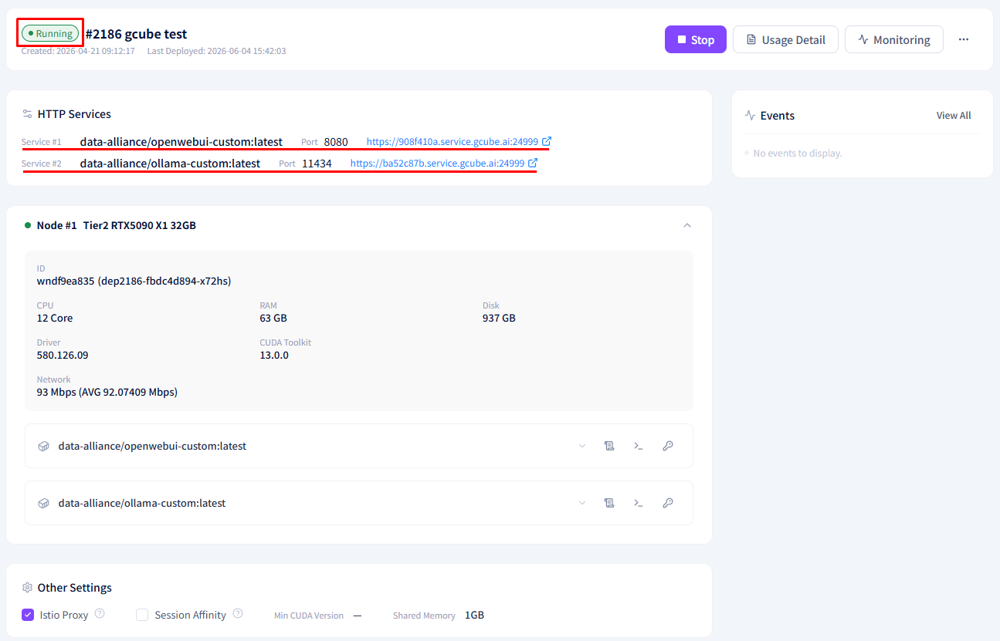

# **Multi-Container Registration Example**

Configure multiple containers with different settings in a single workload.

!!! tip
    Multi-container allows you to register containers A and B — with different images or settings — together in one workload.
    It is also possible to configure multiple containers using the same image.

---

## **What is Multi-Container?**

A configuration that registers two or more containers in a single workload.
Each container can have **independently configured images, ports, environment variables, and commands**.

| Configuration | Container A | Container B |
|---|---|---|
| Image | `ollama/ollama:latest` | `open-webui/open-webui:latest` |
| Role | LLM inference server | Chat UI |
| Port | 11434 | 8080 |

!!! note
    Adding more containers does not increase costs — billing is based on the allocated GPU.
    As long as replicas are not added, the GPU cost ceiling remains unchanged, and all containers share the allocated GPU resources.

!!! warning "Do not confuse Replicas with Multi-Container"
    In gcube, **replicas** refer to the number of GPUs deployed in parallel within a single workload.
    Multi-container is separate — it is a method of configuring **multiple containers with different roles** within one workload.

---

## **Registration Example — Ollama + Open WebUI**

An example of configuring Ollama (inference server) and Open WebUI (chat interface) together in a single workload.

### **① First Container Setup (Ollama)**

| Item | Value |
|---|---|
| Registry Type | Docker Hub |
| Container Image | `ollama/ollama:latest` |
| Container Port | 11434 (auto-filled) |

### **② Add Second Container**

1. Click the **Add Container** button.

    

2. Enter the second container information.

    | Item | Value |
    |---|---|
    | Registry Type | GitHub |
    | Container Image | `open-webui/open-webui:ollama` |
    | Container Port | 8080 (auto-filled) |

    

### **③ Select GPU**

| Item | Value |
|---|---|
| GPU Model | RTX 5090 |
| GPU Memory | 32GB |

### **④ Complete Registration**

1. Confirm the estimated total cost.

    

2. Select immediate deployment and click the **Register** button.

---

## **Post-Deployment Check**

Confirm that all registered containers are running in the **Deployment Status** tab of the workload details.

!!! warning
    If inter-container communication is required (e.g., Open WebUI → Ollama calls), verify port and environment variable settings in advance.

---

[Next: Deploy Workload →](deploy-workload.en.md){ .md-button .md-button--primary }

