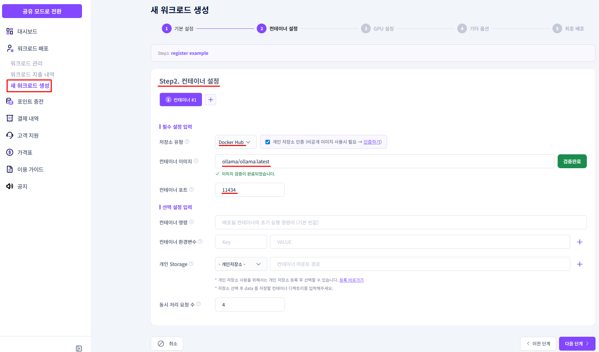
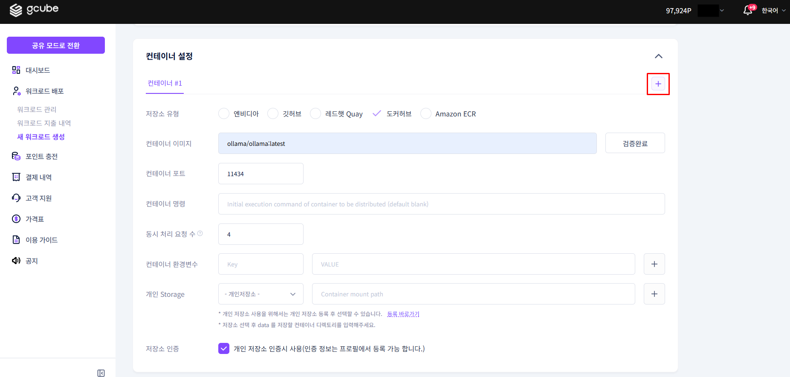
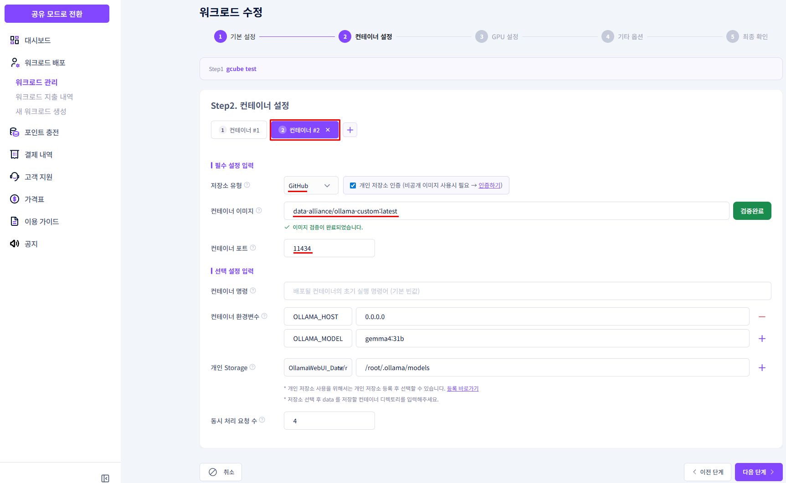
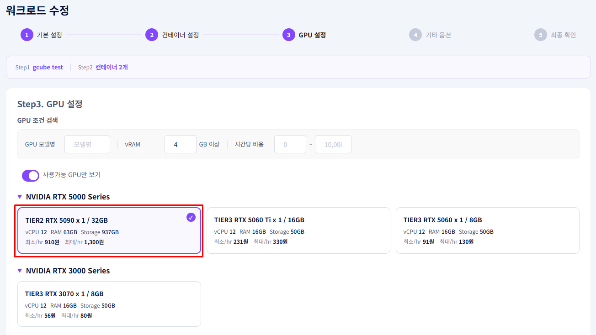
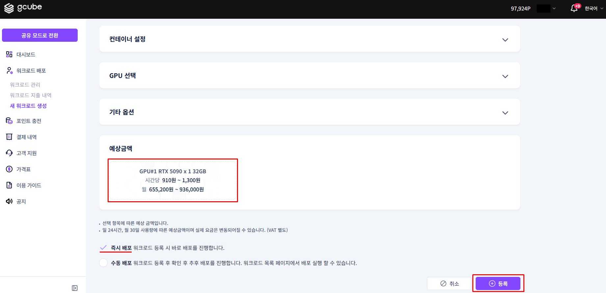
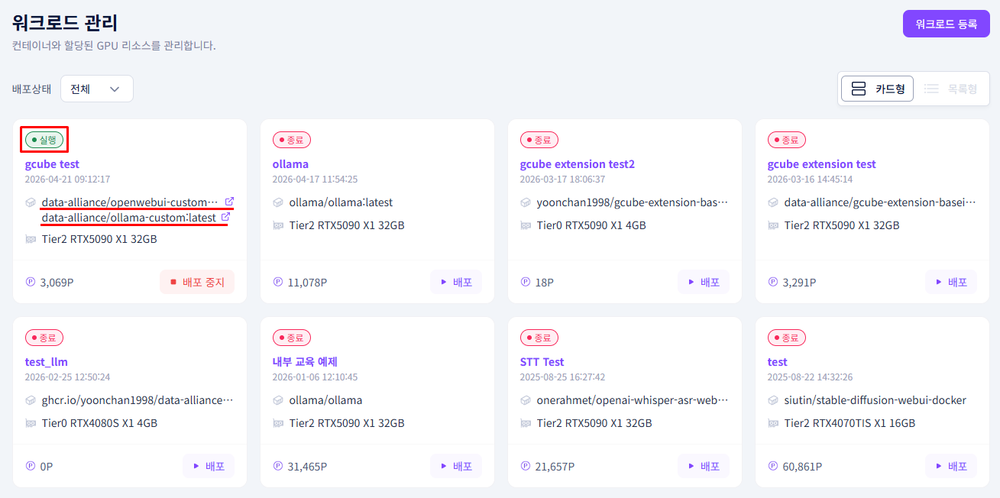

# **멀티 컨테이너 등록 예시**

설정이 다른 컨테이너를 하나의 워크로드에 여러 개 구성합니다.

!!! tip
    멀티 컨테이너는 이미지나 설정이 서로 다른 컨테이너 A, B를 하나의 워크로드 안에 함께 등록하는 방식입니다.  동일한 이미지를 복수로 구성하는 것도 가능합니다.

---

## **멀티 컨테이너란?**

하나의 워크로드에 컨테이너를 2개 이상 등록하는 구성입니다.  각 컨테이너는 **이미지, 포트, 환경변수, 명령어 등을 독립적으로 설정**할 수 있습니다.

| 구성 | 컨테이너 A | 컨테이너 B |
|---|---|---|
| 이미지 | `ollama/ollama:latest` | `open-webui/open-webui:latest` |
| 역할 | LLM 추론 서버 | 채팅 UI |
| 포트 | 11434 | 8080 |

!!! note
    컨테이너가 늘어나도 비용은 할당된 GPU 기준으로 산정됩니다.  레플리카를 추가하지 않는 한 GPU 비용의 상한은 변하지 않으며, 컨테이너들이 할당된 GPU 자원을 나눠 사용합니다.

!!! warning "레플리카와 멀티 컨테이너 혼동 주의"
    gcube에서 **레플리카**는 하나의 워크로드에 다수의 GPU를 병행 투입하는 단위입니다.  멀티 컨테이너는 이와 별개로, 하나의 워크로드 안에 **역할이 다른 컨테이너를 복수로 구성**하는 방식입니다.

---

## **등록 예시 — Ollama + Open WebUI**

Ollama(추론 서버)와 Open WebUI(채팅 인터페이스)를 하나의 워크로드에 함께 구성하는 예시입니다.

### **① 첫 번째 컨테이너 설정 (Ollama)**

| 항목 | 입력값 |
|---|---|
| 저장소 유형 | 도커허브 |
| 컨테이너 이미지 | `ollama/ollama:latest` |
| 컨테이너 포트 | 11434 (자동 입력) |

### **② 두 번째 컨테이너 추가**

1. **컨테이너 추가** 버튼을 클릭합니다.

    

2. 두 번째 컨테이너 정보를 입력합니다.

    | 항목 | 입력값 |
    |---|---|
    | 저장소 유형 | 깃허브(GitHub) |
    | 컨테이너 이미지 | `open-webui/open-webui:ollama` |
    | 컨테이너 포트 | 8080 (자동 입력) |

    

### **③ GPU 선택**

| 항목 | 입력값 |
|---|---|
| GPU 모델 | RTX 5090 |
| GPU 메모리 | 32GB |

### **④ 등록 완료**

1. 총 예상 금액을 확인합니다.

    

2. 즉시 배포를 선택하고 **등록** 버튼을 클릭합니다.

---

## **배포 후 확인**

워크로드 세부 정보의 **배포 상태** 탭에서 등록한 컨테이너가 모두 실행 중인지 확인합니다.

!!! warning
    컨테이너 간 통신이 필요한 경우 (예: Open WebUI → Ollama 호출) 포트와 환경변수 설정을 사전에 확인하세요.
