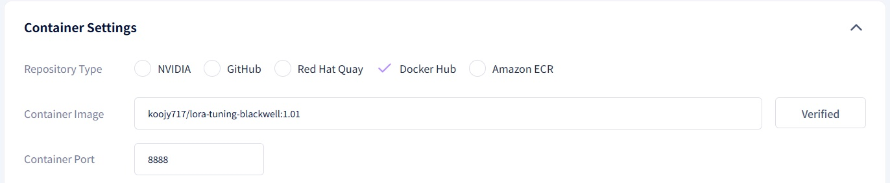

# **Workload Registration Example**

This document provides examples of workload registration for deep learning development <br>
For detailed instructions on the actual registration process, please refer to the [Register New Workload](https://data-alliance.github.io/gai-platform-docs/user-guide/workload/register-new-workload/) documentation. <br><br>

## **Overview**

The `koojy717/lora-tuning-blackwell:1.01` image contains essential frameworks and tools required for deep learning development.

### **Key Components**

- **PyTorch 2.7.0** (Supports CUDA 12.8)
- TensorFlow 2.12.0
- Transformers 4.28.0
- PEFT 0.3.0
- Jupyter Notebook/Lab environment
- **System Management Tools** (net-tools, ping, traceroute)

※ **Note**: PyTorch version 2.7.0 is a **nightly build** rapidly developed for NVIDIA’s **Blackwell architecture**; as such, it may not exhibit consistent performance.

If you prefer a more stable, previous version of PyTorch, please use the`koojy717/lora-tuning:1.02` image, which includes Pytorch 2.01(CUDA 11.8 지원).

### **Workload Configuration Guide**



### **Container Image**

```cpp
=== "GitHub"
    ```
    data-alliance/lora-tuning-blackwell:1.01
    ```

=== "Docker Hub"
    ```
    koojy717/lora-tuning-blackwell:1.01
    ```
    
=== "Lower Pytorch Version Docker Hub"
		```
		koojy717/lora-tuning:1.02
		```
```

---

### **Target Specifications**

Recommended settings based on workload scale:

| Target | Tier | GPU Memory | Usage |
| --- | --- | --- | --- |
| Large-scale Training | Tier 1 (A100, H100) | 40GB+ | Large-scale model training, requiring high performance. |
| Mid-scale Experiment | Tier 2 (전용 서버) | 20GB | General model development and mid-scale experiments. |
| Dev / Testing | Tier 3 (PC방, 개인) | 10GB | Code development and small-scale experiments. |

⚡ For detailed instructions on how to register a workload, please refer to the [Register New Workload](https://data-alliance.github.io/gai-platform-docs/user-guide/workload/register-new-workload/) page.

---

## **Getting Started with Jupyter Notebook**

After the workload has been successfully created, access the environment using the **Service URL** provided on the workload details page.

You can verify your development environment and perform basic computational tests by creating a new notebook in the default working directory.

### **1. Verifying the Environment**

Execution Code:

```python
import torch
import tensorflow as tf
import transformers
# Check Version print(f"PyTorch: {torch.__version__}")
print(f"TensorFlow: {tf.__version__}")
print(f"Transformers: {transformers.__version__}")
# Check GPU print(f"PyTorch GPU: {torch.cuda.is_available()}")
print(f"TensorFlow GPU: {tf.config.list_physical_devices('GPU')}")
```

Expected Results:

```
PyTorch: 2.0.1+cu118
TensorFlow: 2.12.0
Transformers: 4.28.0
PyTorch GPU: True
TensorFlow GPU: [PhysicalDevice(name='/physical_device:GPU:0', device_type='GPU')]
```

### **2. PyTorch Environment Test**

Execution Code:

```python
import torch
if torch.cuda.is_available():
    # GPU Information    print(f"GPU: {torch.cuda.get_device_name(0)}")
    print(f"Memory: {torch.cuda.get_device_properties(0).total_memory / 1e9:.2f} GB")
    # Matrix Operation Test    a = torch.tensor([[1.0, 2.0], [3.0, 4.0]]).cuda()
    b = torch.tensor([[5.0, 6.0], [7.0, 8.0]]).cuda()
    # Matrix Multiplication    c = torch.matmul(a, b)
    print("\nMatrix A:")
    print(a.cpu().numpy())
    print("\nMatrix B:")
    print(b.cpu().numpy())
    print("\nMatrix Multiplication Result (A × B):")
    print(c.cpu().numpy())
```

Expected Results:

```
GPU: NVIDIA GeForce RTX 3060
Memory: 12.88 GB

Matrix A:
[[1. 2.]
 [3. 4.]]

Matrix B:
[[5. 6.]
 [7. 8.]]

Matrix Multiplication Result (A × B):
[[19. 22.]
 [43. 50.]]
```

🔗 [View More PyTorch Tutorials](https://pytorch.org/tutorials/beginner/basics/intro.html)

### **3. TensorFlow Environment Test**

Execution Code:

```python
import tensorflow as tf
if tf.config.list_physical_devices('GPU'):
    # GPU Meomory Configuration   gpus = tf.config.experimental.list_physical_devices('GPU')
    tf.config.experimental.set_memory_growth(gpus[0], True)
    # Simple Computation Test    with tf.device('/GPU:0'):
        x = tf.random.normal([1000, 1000])
        y = tf.matmul(x, x)
        print("GPU Computation Test Completed Successfully")
```

Expected Results:

```
GPU Computation Test Completed Successfully
```

🔗 [Getting Started with TensorFlow](https://www.tensorflow.org/tutorials/quickstart/beginner)

### **4. Transformers Environment Test**

Execution Code:

```python
from transformers import AutoModel, AutoTokenizer
model_name = "bert-base-uncased"tokenizer = AutoTokenizer.from_pretrained(model_name)
model = AutoModel.from_pretrained(model_name)
if torch.cuda.is_available():
    model = model.cuda()
    print("Model successfully loaded onto GPU")
```

Expected Results:

```
Model successfully loaded onto GPU
```

🔗 [View More Transformers Tutorials](https://huggingface.co/docs/transformers/training)

---

!!! Warning

**Please be aware that all data and environmental settings currently in use will not be saved when the workload is terminated.**<br>
**Training data and results can be stored using a persistent volume (PV).**


## **References & Resources**

- [PyTorch Documentation](https://pytorch.org/docs/stable/index.html)
- [TensorFlow GPU Guide](https://www.tensorflow.org/guide/gpu)
- [Transformers Documentation](https://huggingface.co/docs/transformers)

### **Contact Support**

If you encounter any issues or require further assistance, please contact the **gcube Support Team** 
**📧 [gcube.ai@data-alliance.com](mailto:gcube.ai@data-alliance.com)**