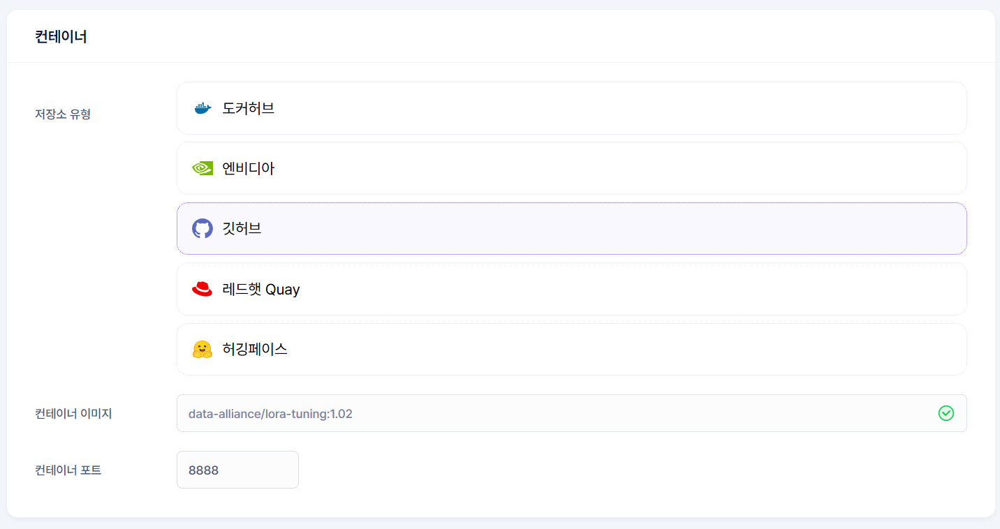

# 워크로드 등록 예시

이 문서는 딥러닝 개발을 위한 워크로드 등록 예시를 설명합니다.
실제 등록 방법은 [새 워크로드 등록](https://data-alliance.github.io/gai-platform-docs/user-guide/workload/register-new-workload/) 문서를 참고해 주세요.


## 개요
`data-alliance/lora-tuning:1.02` 이미지는 딥러닝 개발에 필요한 주요 프레임워크와 도구들이 포함되어 있습니다:

### 주요 구성 요소
- PyTorch 2.0.1 (CUDA 11.8 지원)
- TensorFlow 2.12.0
- Transformers 4.28.0
- PEFT 0.3.0
- Jupyter Notebook/Lab 환경
- 시스템 관리 도구 (net-tools, ping, traceroute)

- - -

## 워크로드 설정 가이드

### 컨테이너 설정
 <br>

- **저장소 유형**: 깃허브 <br>

- **컨테이너 이미지**: `data-alliance/lora-tuning:1.02` <br>

- **컨테이너 포트**: 8888 (이미지 검증 시 자동입력됨) <br>


### 목적스펙 설정
작업 규모에 따른 권장 설정:

| 목적 | Tier | GPU 메모리 | 용도 |
|------|------|------------|-------|
| 대규모 학습 | Tier 1 (A100, H100) | 40GB+ | 대규모 모델 학습, 높은 성능 필요 시 |
| 중규모 실험 | Tier 2 (전용 서버) | 20GB | 일반적인 모델 개발, 중규모 실험 |
| 개발/테스트 | Tier 3 (PC방, 개인) | 10GB | 코드 개발, 소규모 실험 |

⚡ 자세한 워크로드 등록 방법은 [새 워크로드 등록](https://data-alliance.github.io/gai-platform-docs/user-guide/workload/register-new-workload/) 페이지를 참고해 주세요.

- - -

## Jupyter Notebook 시작하기
워크로드 생성 완료 후, 상세 페이지에서 제공되는 Service URL로 접속하세요. <br>
기본 작업 디렉토리에서 새 노트북을 생성하여 개발 환경을 확인하고, 기본 연산 테스트를 수행할 수 있습니다.

### 1. 기본 환경 확인
실행 코드: 
```python
import torch
import tensorflow as tf
import transformers

# 버전 확인
print(f"PyTorch: {torch.__version__}")
print(f"TensorFlow: {tf.__version__}")
print(f"Transformers: {transformers.__version__}")

# GPU 확인
print(f"PyTorch GPU: {torch.cuda.is_available()}")
print(f"TensorFlow GPU: {tf.config.list_physical_devices('GPU')}")
```
결과:
```
PyTorch: 2.0.1+cu118
TensorFlow: 2.12.0
Transformers: 4.28.0
PyTorch GPU: True
TensorFlow GPU: [PhysicalDevice(name='/physical_device:GPU:0', device_type='GPU')]
```

### 2. PyTorch 환경 테스트
실행 코드: 
```python
import torch

if torch.cuda.is_available():
    # GPU 정보
    print(f"GPU: {torch.cuda.get_device_name(0)}")
    print(f"메모리: {torch.cuda.get_device_properties(0).total_memory / 1e9:.2f} GB")
    
    # 행렬 연산 테스트
    a = torch.tensor([[1.0, 2.0], [3.0, 4.0]]).cuda()
    b = torch.tensor([[5.0, 6.0], [7.0, 8.0]]).cuda()
    
    # 행렬 곱 연산
    c = torch.matmul(a, b)
    print("\n행렬 A:")
    print(a.cpu().numpy())
    print("\n행렬 B:")
    print(b.cpu().numpy())
    print("\n행렬 곱 결과 (A × B):")
    print(c.cpu().numpy())
```
결과: 
```
GPU: NVIDIA GeForce RTX 3060
메모리: 12.88 GB

행렬 A:
[[1. 2.]
 [3. 4.]]

행렬 B:
[[5. 6.]
 [7. 8.]]

행렬 곱 결과 (A × B):
[[19. 22.]
 [43. 50.]]
```
🔗 [PyTorch 튜토리얼 더 보기](https://pytorch.org/tutorials/beginner/basics/intro.html)

### 3. TensorFlow 환경 테스트
실행 코드: 
```python
import tensorflow as tf

if tf.config.list_physical_devices('GPU'):
    # GPU 메모리 설정
    gpus = tf.config.experimental.list_physical_devices('GPU')
    tf.config.experimental.set_memory_growth(gpus[0], True)
    
    # 간단한 연산 테스트
    with tf.device('/GPU:0'):
        x = tf.random.normal([1000, 1000])
        y = tf.matmul(x, x)
        print("GPU 연산 테스트 완료")
```
결과:
```
GPU 연산 테스트 완료
```
🔗 [TensorFlow 시작하기](https://www.tensorflow.org/tutorials/quickstart/beginner)

### 4. Transformers 환경 테스트
실행 코드: 
```python
from transformers import AutoModel, AutoTokenizer

model_name = "bert-base-uncased"
tokenizer = AutoTokenizer.from_pretrained(model_name)
model = AutoModel.from_pretrained(model_name)

if torch.cuda.is_available():
    model = model.cuda()
    print("모델 GPU 로드 완료")
```
결과:
```
모델 GPU 로드 완료
```
🔗 [Transformers 튜토리얼 더 보기](https://huggingface.co/docs/transformers/training)

- - -

!!! Warning  
      워크로드 종료 시, 작업 중이던 데이터 및 환경은 **저장되지 않으니** 유의하시기 바랍니다.   
      (향후 외부 스토리지를 이용하여 저장할 수 있도록 업데이트 할 예정입니다.)


## 참고 자료
- [PyTorch 문서](https://pytorch.org/docs/stable/index.html)
- [TensorFlow GPU 가이드](https://www.tensorflow.org/guide/gpu)
- [Transformers 문서](https://huggingface.co/docs/transformers)

문제가 발생하거나 추가 지원이 필요한 경우 gcube 지원팀(gcube.ai@data-alliance.com)에 문의해 주세요.


