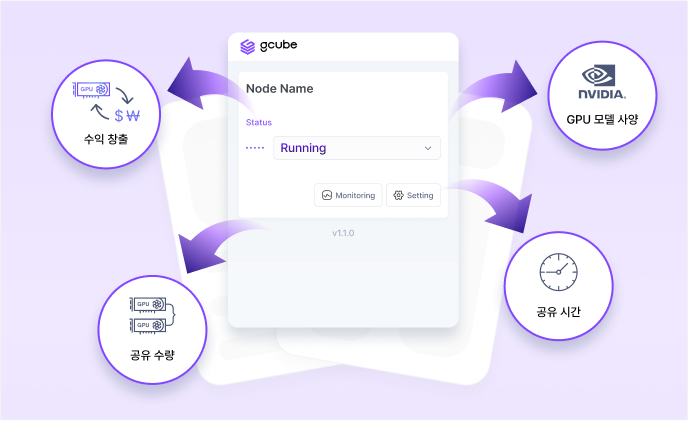

# 워크로드 사용자 가이드

[대쉬보드](./workload-home.md)

[프로필 설정](./profile-settings.md)

[새 워크로드 등록](./register-new-workload.md)

[워크로드 등록 예시](./example-workload.md)

[워크로드 배포](./deploy-workload.md)

[워크로드 모니터링](./monitor-workload.md)

[워크로드 이용내역](./workload-expenses.md)

[워크로드 종료](./terminate-workload.md)

[저장소 관리 설정](./pv-user-guide.md)