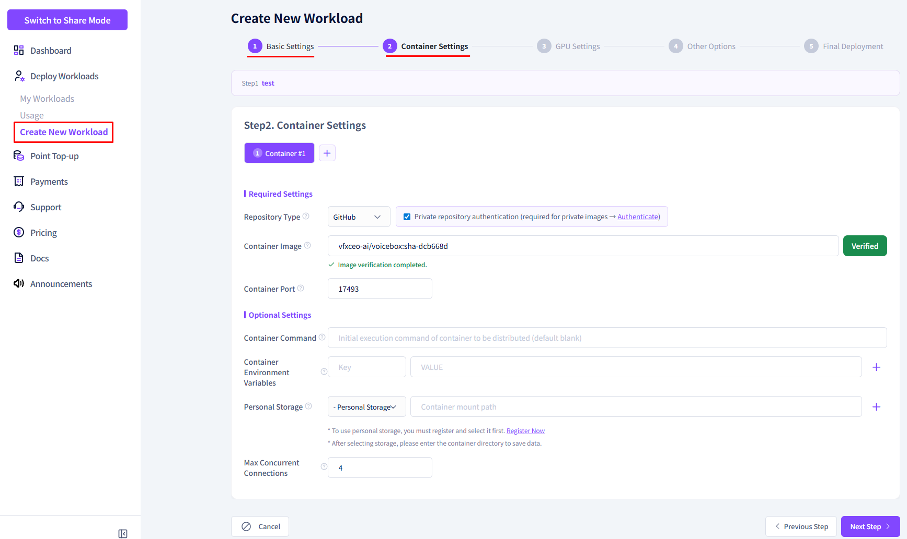
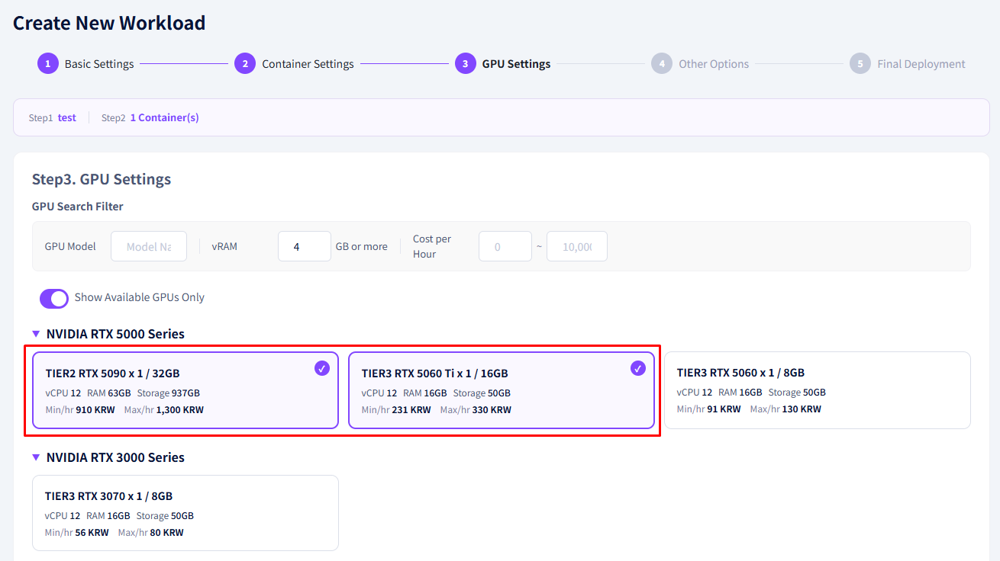
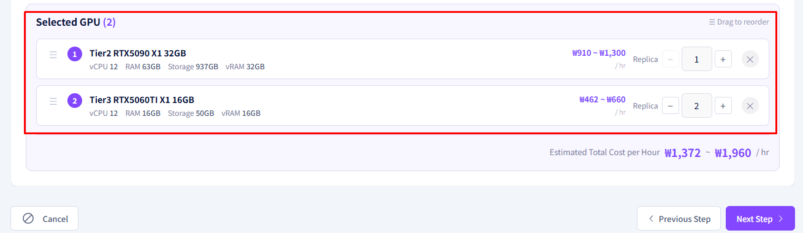
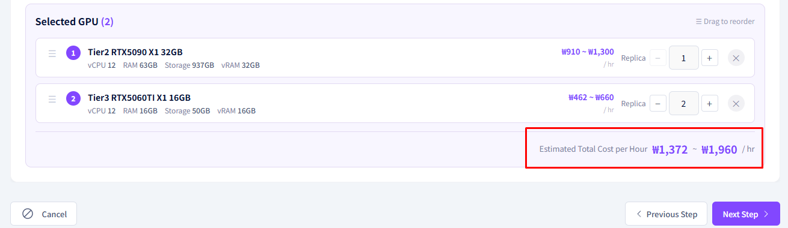

# **Multi-GPU Workload Registration**

Connect multiple GPUs to a single workload to handle large-scale AI tasks.

!!! tip
    Multi-GPU workloads are used for large model training, inference, and rendering tasks that are difficult to handle with a single GPU. Parallel processing performance scales with the number of GPUs.

---

## **Single GPU vs Multi-GPU Comparison**

| Item | Single GPU | Multi-GPU |
|---|---|---|
| Suitable for | Small-scale inference, testing | Large-scale training, large models |
| VRAM | Based on 1 GPU | Number of GPUs × individual VRAM |
| Cost | Low | Proportional to number of GPUs |
| Setup complexity | Low | Moderate |

---

## **Before You Begin**

- Make sure you have enough points charged. (Number of GPUs × hourly rate)
- Prepare a container image that supports multi-GPU.
- Decide on the number and model of GPUs you need in advance.

---

## **How to Register**

1. Complete the container setup on the new workload registration screen. (The screen below is an example.)

    

2. Select your desired GPU model in the GPU selection section.

    

3. Choose how many GPUs to allocate for the selected model.

    

    !!! warning
        Make sure the selected GPU model is available in the required quantity on the same node.
        If the quantity is insufficient, deployment may be delayed.

    !!! note "Heterogeneous GPU Selection"
        You can select multiple GPUs of the same model or mix different GPU models.

4. Confirm the estimated total cost. Costs increase proportionally with the number of GPUs.

    

5. Select whether to deploy immediately and click the **Register** button.

---

## **Multi-GPU Usage Examples**

| Model | Recommended GPU Config | Use Case |
|---|---|---|
| LLaMA3 70B | A100 × 2 (80GB VRAM) | Large LLM inference |
| Stable Diffusion XL | RTX 3090 × 2 | High-resolution batch image generation |
| Training (Fine-tuning) | RTX 4090 × 4 | Model fine-tuning |

---

[Next: Multi-Container Registration Example →](example-multi-container.en.md){ .md-button .md-button--primary }

