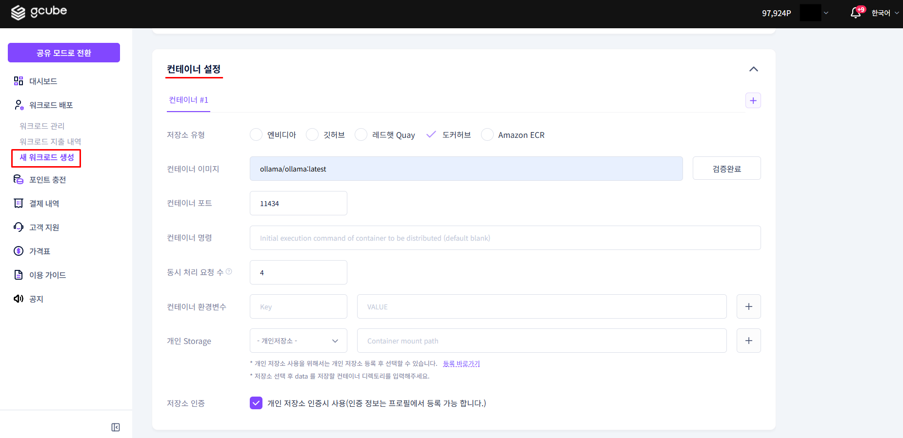
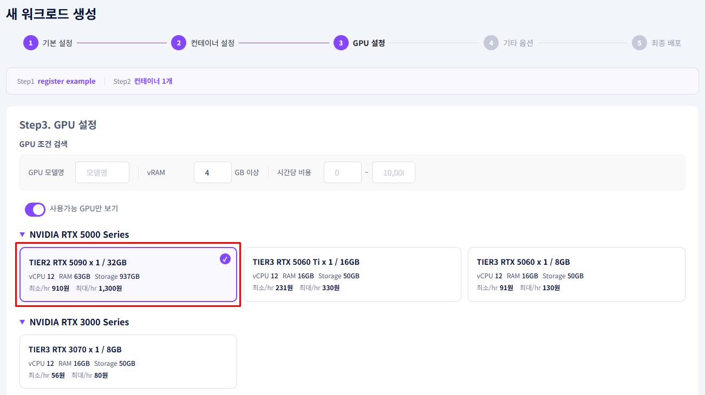
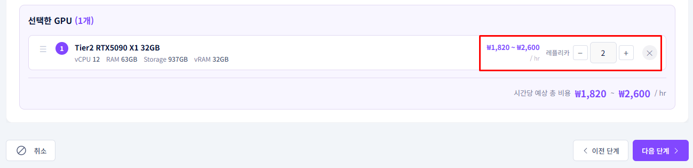
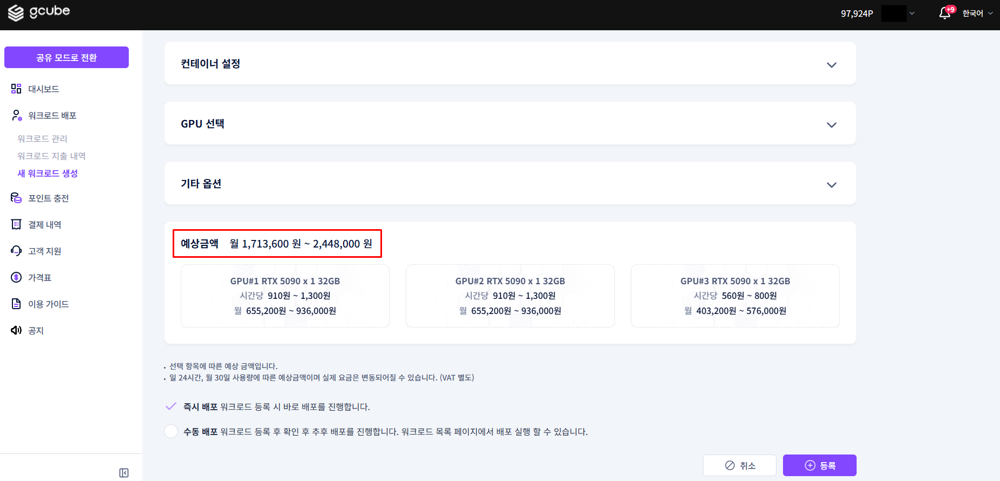

# **멀티 GPU 워크로드 등록**

여러 대의 GPU를 하나의 워크로드에 연결해 대규모 AI 작업을 처리합니다.

!!! tip
    멀티 GPU 워크로드는 단일 GPU로 처리하기 어려운 대용량 모델 학습, 추론, 렌더링 작업에 사용합니다. GPU 수만큼 병렬 처리 성능이 향상됩니다.

---

## **단일 GPU vs 멀티 GPU 비교**

| 항목 | 단일 GPU | 멀티 GPU |
|---|---|---|
| 적합한 작업 | 소규모 추론, 테스트 | 대규모 학습, 대용량 모델 |
| VRAM | 1개 GPU 기준 | GPU 수 × 개별 VRAM |
| 비용 | 낮음 | GPU 수에 비례 |
| 설정 복잡도 | 낮음 | 중간 |

---

## **시작 전 확인사항**

- 포인트가 충분히 충전되어 있어야 합니다. (GPU 수 × 시간당 단가)
- 멀티 GPU를 지원하는 컨테이너 이미지를 준비합니다.
- 필요한 GPU 수와 모델을 미리 결정합니다.

---

## **등록 방법**

1. 새 워크로드 등록 화면에서 컨테이너 설정을 완료합니다. (아래 화면은 예시입니다.)

    

2. GPU 선택 섹션에서 원하는 레플리카 수를 설정합니다.

    

3. 설정한 레플리카 수 만큼 GPU를 선택합니다.

    

    !!! warning
        선택한 GPU 모델이 동일 노드에서 요청 수량만큼 사용 가능한지 확인하세요.  수량이 부족하면 배포가 지연될 수 있습니다.

    !!! note "이기종 GPU 선택 여부"
        단일 GPU 기종을 복수 선택하거나 이기종 GPU 기종을 복수 선택할 수 있습니다.

4. 총 예상 금액을 확인합니다. GPU 수량에 비례해 비용이 증가합니다.

    

5. 즉시 배포 여부를 선택하고 **등록** 버튼을 클릭합니다.

---

## **멀티 GPU 활용 예시**

| 모델 | 권장 GPU 구성 | 용도 |
|---|---|---|
| LLaMA3 70B | A100 × 2 (80GB VRAM) | 대용량 LLM 추론 |
| Stable Diffusion XL | RTX 3090 × 2 | 고해상도 이미지 배치 생성 |
| 학습 작업 (Fine-tuning) | RTX 4090 × 4 | 모델 파인튜닝 |
