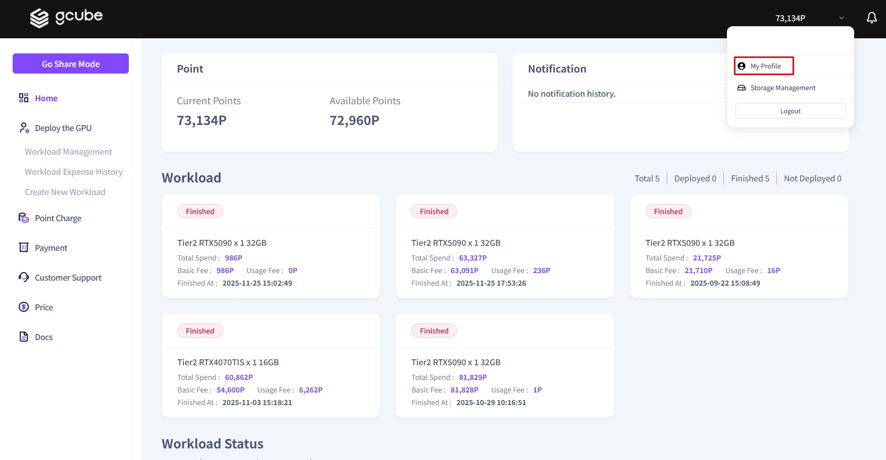
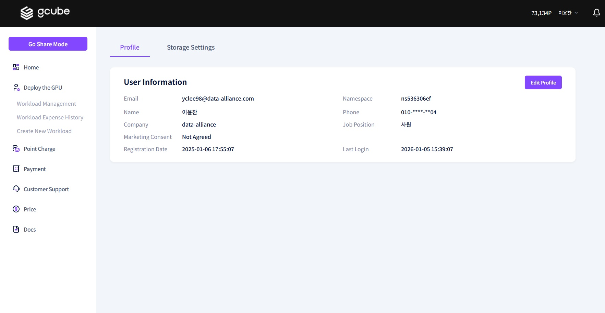

# **Profile Setup**

You can configure your account information through the Profile Settings menu.   

1\. Click the arrow next to your name → Click **"My Profile"**.  

2\. As shown in the screen above, you can view and verify your "User Information".  

3\. **Click "Edit Profile"** → Modify the desired information in the profile update pop-up window, then click the "Edit" button to complete the profile modification.