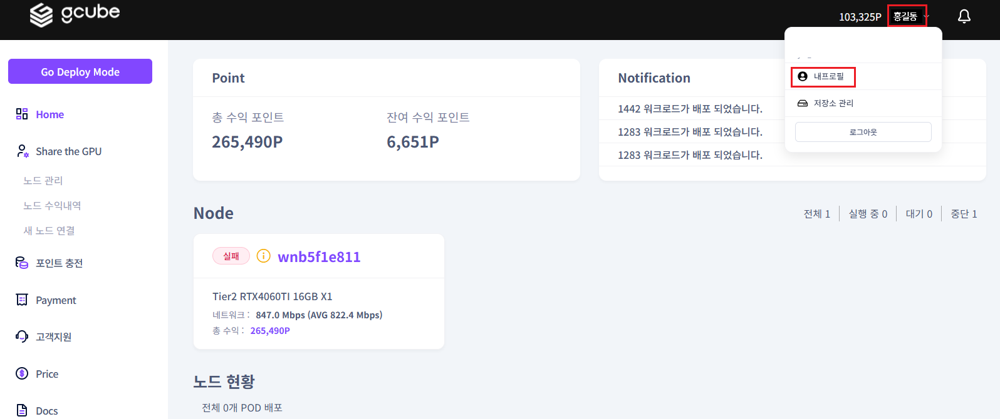

# **프로필 설정**

프로필 설정을 통해 계정의 정보를 설정할 수 있습니다.   

1\. 이름 옆 화살표 클릭 → **“내 프로필”** 클릭  

2\. 위 화면과 같이 “사용자 정보” 확인이 가능합니다.  

3\. **“프로필 수정”** 클릭 → 프로필 정보 수정 팝업 화면에서 원하는 정보를 수정하여 **“수정”** 버튼 클릭하면 프로필 정보 수정이 완료됩니다.