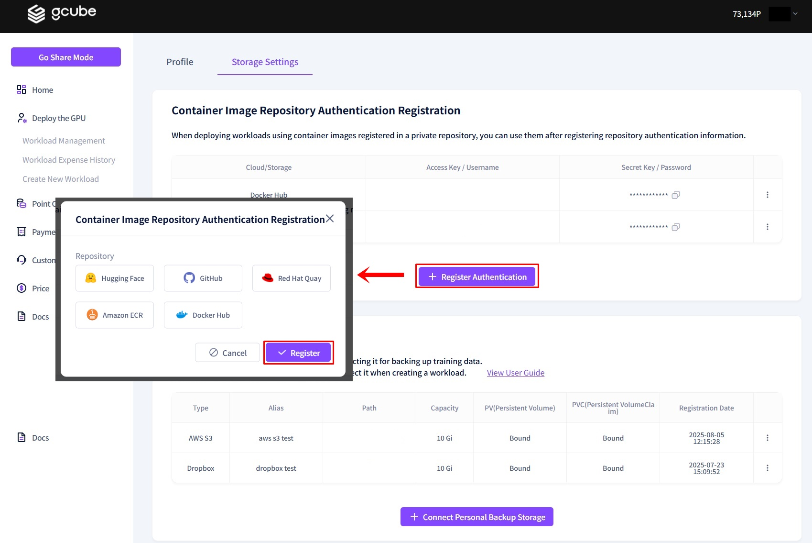
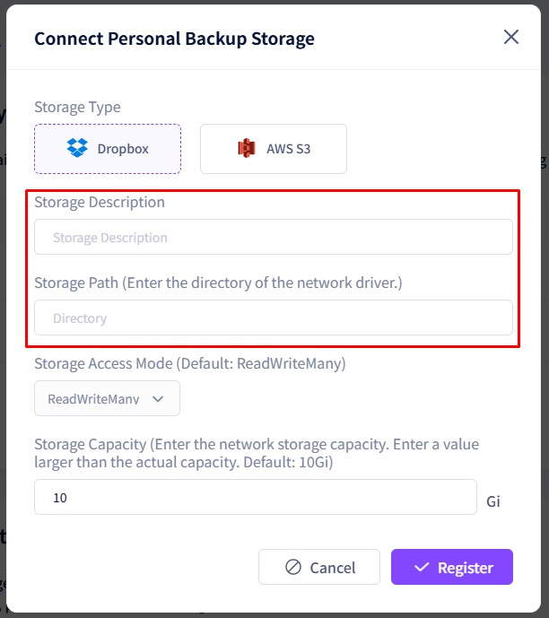

# **Storage Management Setup**

Through Storage Management, you can configure container image repository and backup data storage information.   

1\. Click the arrow next to your name → Click **“Storage Management”**   

2\. As shown in the screen above, you can configure “Register Authentication” and “Connect Personal Backup Storage.”  

- **Register Authentication**: To use container images from a private repository when setting up a workload, you must register your repository credentials to access the image information. 
- **Connect Personal Backup Storage**: You can connect and save your trained data to a personal storage space.     

3\. Register Authentication: Click **“+ Register Authentication”** → Select the **“Repository”** provider → Enter the required information → Click the **“Register”** button to complete the process.   

4\. Click the **“Edit”** button for user credentials → Modify the information in the pop-up window → Click the **“Register”** button to complete the modification.   

5\. Connect Personal Backup Storage: Click **“+ Connect Personal Backup Storage”** → Select the **“Type”** in the storage registration pop-up → Enter the required information → Click the **“Register”** button to complete the process.   
6\. When registering storage information, set a Storage Alias to be displayed in the list and specify the Folder Path within the storage to be linked before saving.    
[Example: “/data/data” is the path where Dropbox is mounted inside the container. You can read and write files at this location.]   

The access method and capacity can be adjusted as needed.

- dropbox 
    
    
- aws s3 
[For AWS storage, you must enter the IAM access key, secret access key, and the bucket region.]   
   