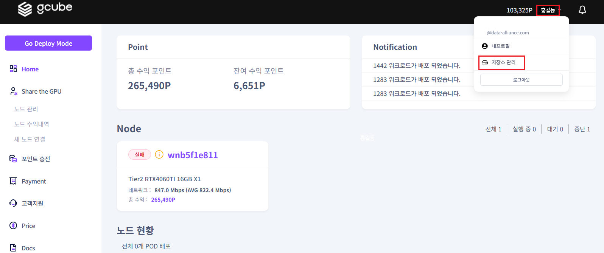
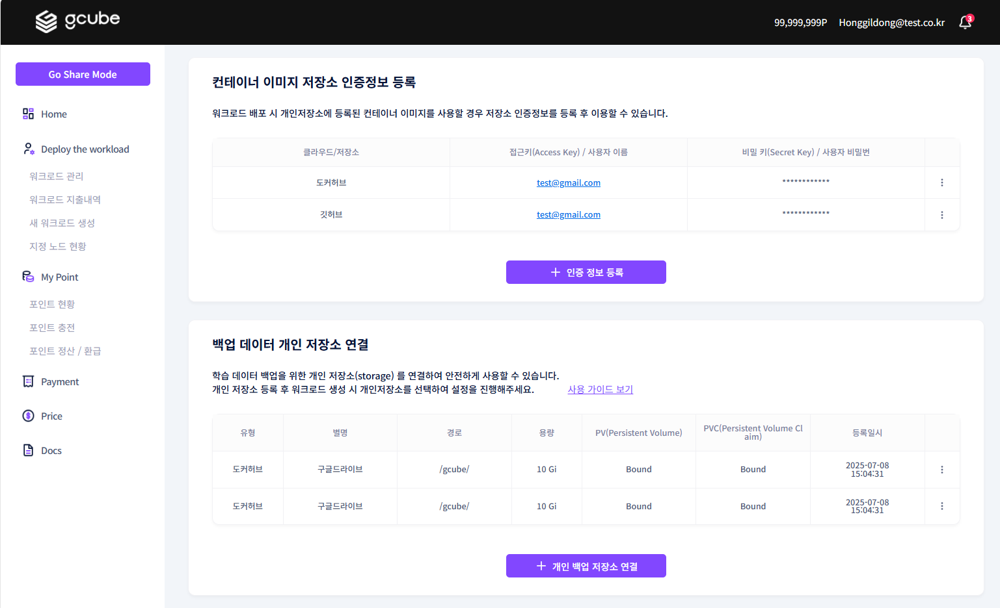
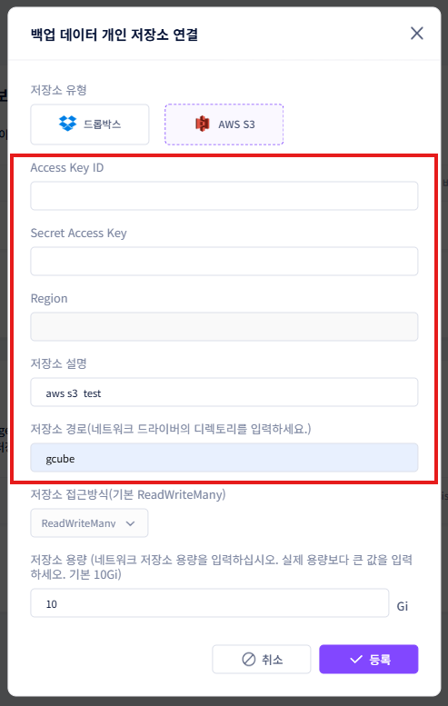

# **저장소 관리 설정**

저장소 관리를 통해 컨테이너 이미지 저장소와 백업 데이터 Storage 정보를 설정할 수 있습니다.   

1\. 이름 옆 화살표 클릭 → **“저장소 관리”** 클릭   

2\. 위 화면과 같이 “컨테이너 이미지 저장소 인증정보 등록” 과 “백업 데이터 개인 저장소 연결” 설정이 가능합니다.  

- 컨테이너 이미지 저장소 인증정보 : 워크로드 설정 시 개인 저장소에 있는 컨테이너 이미지를 사용할 경우 개인 저장소 인증 정보를 등록해야 이미지 정보를 워크로드 사용 시 이용할 수 있습니다. 
- 백업 데이터 개인 저장소 : 학습한 데이터를 저장할 수 있는 개인 Storage를 연결하여 저장할 수 있습니다.     

3\. **컨테이너 이미지 저장소 인증정보 등록 : “+ 인증 정보 등록”** 클릭 ****→ 사용할 “**저장소**” 제공 업체를 선택 후 필요한 정보 입력  → **“등록”** 버튼 클릭 시 등록 완료되어집니다.   

4\. 사용자 인증정보 “**편집**” 버튼 클릭 → 사용자 인증정보 팝업 화면에서 관련 정보 수정하여 **“수정”** 버튼 클릭하면 사용자 인증정보 수정이 완료됩니다.   

5\. **백업 데이터 개인 저장소 연결 : “+ 개인 백업 저장소 연결”** 클릭 ****→ 저장소 정보 등록 팝업 화면에서 “**유형**”을 선택 → 사용할 “**저장소**” 제공 업체를 선택 후 필요한 정보 입력  → **“등록”** 버튼 클릭 시 등록 완료되어집니다.   
6\. 저장소 정보 등록 시 목록에 표시될 저장소 설명을 설정한 후 저장소 내 연동할 폴더 경로를 설정 후 저장해주세요.   
[예: “/data/data”는 컨테이너 내부에서 dropbox가 마운트되는 경로입니다. 이 위치에 파일을 읽고 쓸 수 있습니다.]   

접근 방식 및 용량은 필요에 따라 조정하시면 됩니다. 

- dropbox 
    
    
- aws s3 
[AWS 저장소는 IAM의 access key와 secret access key, bucket의 region을 넣어야 합니다.]  
   