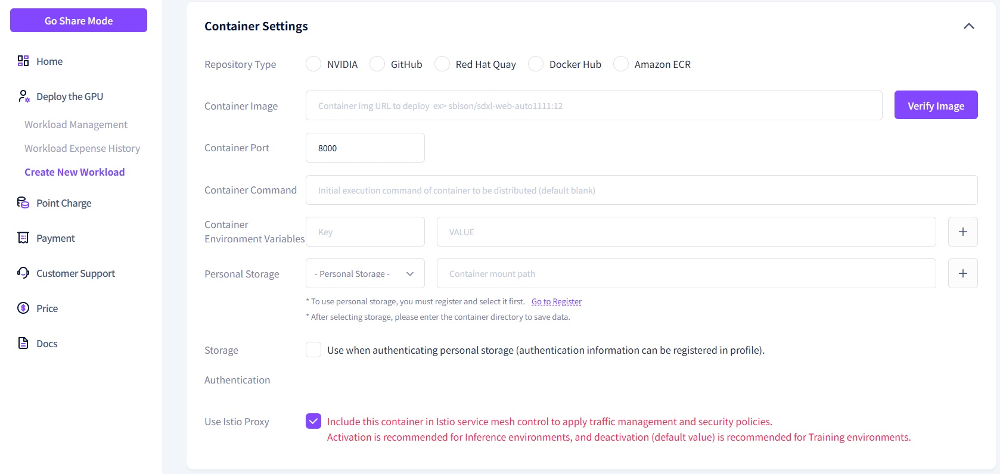
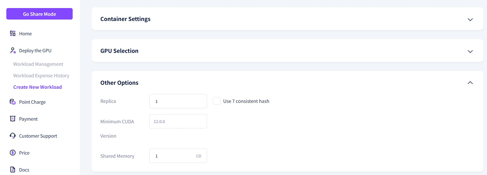
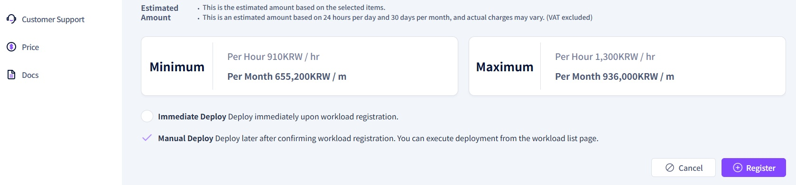

# **Register New Workload**

To utilize Gcube’s GPU resources, you must complete the 'Register New Workload' process. <br><br>


1\. In Deploy mode, click the **"Create New Workload** menu.<br><br>

2\. Enter the required information into each field on the Workload Registration page.<br>


- **Workload Description**: Provide a brief summary of the workload's purpose and key features.

### **컨테이너**



- **Storage Type:** Select the platform where your container image is stored.
- **Container Image:** Enter the container image URL, referring to the input format for each storage type provided below.
- **Container Port:** The network port used by the container. This will be automatically populated during image verification.

```markdown
=== "Docker Hub"
    ```
    username/repository:tag
    ```
    예시: `ollama/ollama:latest`

=== "NVIDIA NGC"
    ```
    nvcr.io/nvidia/repository:tag
    ```
    예시: `nvcr.io/nvidia/cuda:12.0.0-base-ubuntu22.04`

=== "GitHub"
    ```
    ghcr.io/owner/repository:tag
    ```
    예시: `ghcr.io/organization/app:1.0`

=== "Red Hat Quay"
    ```
    quay.io/namespace/repository:tag
    ```
    예시: `quay.io/redhat/ubi8:latest`

=== "Hugging Face"
    ```
    registry.hf.space/username/repository:tag
    ```
    예시: `registry.hf.space/username/model-server:v1`

```

Example:

```
ollama/ollama:latest
```

**Image Verification Check**

- If a valid image URL is entered, a green checkmark will appear and the port will be automatically populated.
- If the image is invalid, a red checkmark will appear and the port will not be entered.

- **Container Command:** Sets the `CMD` item from the Dockerfile (the command to be executed when the container starts).
- **Container Environment Variables:** Sets the `ENV` items from the Dockerfile (environment variables to be used inside the container).
- **Personal Storage:** Set up personal storage information to back up trained data. Personal storage can be used after being registered through "Storage Management."
- **Storage Authentication:** Check this if you are using a container image from a private repository. This is only available if the private storage authentication has been completed via "Storage Management."

### **GPU 선택**


You can select the target node to be used for your workload. By enabling the 'View Available GPUs Only' toggle, you can filter the list to show only GPUs that are currently ready for use. Additionally, you can search for and filter GPUs based on Model Name, vRAM, and Cost.

- **GPU Model Name:** When you enter or select a GPU model, the available GPU resource items for that specific model will be displayed.
    - `Tier 1` : Cloud Service Providers (CSPs)
    - `Tier 2` : Dedicated Servers (Data Centers)
    - `Tier 3` : Internet Cafes (PC Bangs) and Individuals
- **GPU Memory:** Set the required GPU memory capacity. The available GPUs will be filtered according to the value you set.
- **Cost:** Enter the minimum and maximum hourly cost to display GPU models that fall within that price range. This allows you to select a GPU model that fits your budget.

### **옵션**



- **Replica:** Specifies the number of container instances to be deployed.
- **Minimum CUDA Version:** Specifies the required version of CUDA.
- **Shared Memory:** Sets the size of the area designed for data sharing between processes.

### **Register**



- Check the total estimated cost, choose whether to deploy immediately, and then click the 'Register' button.<br><br>


3\. The workload has been created and can now be viewed in the list.