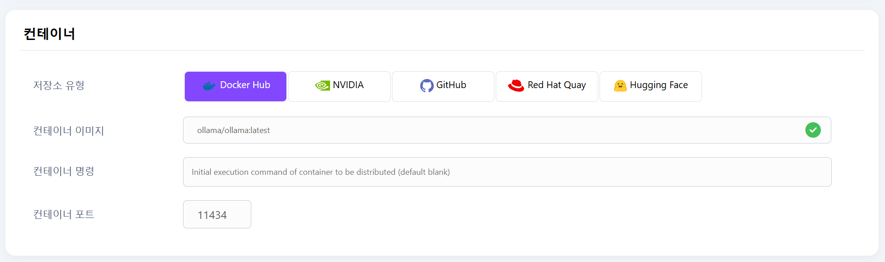
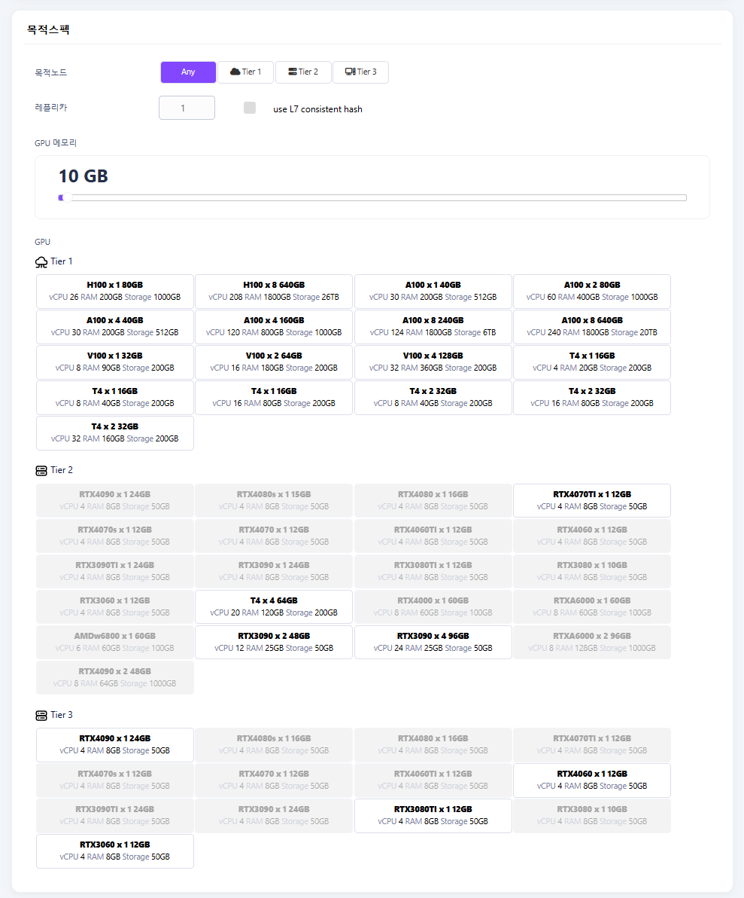
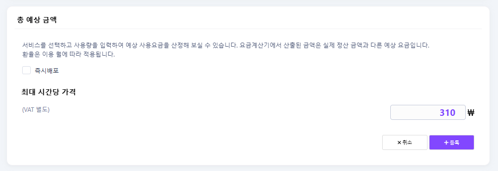
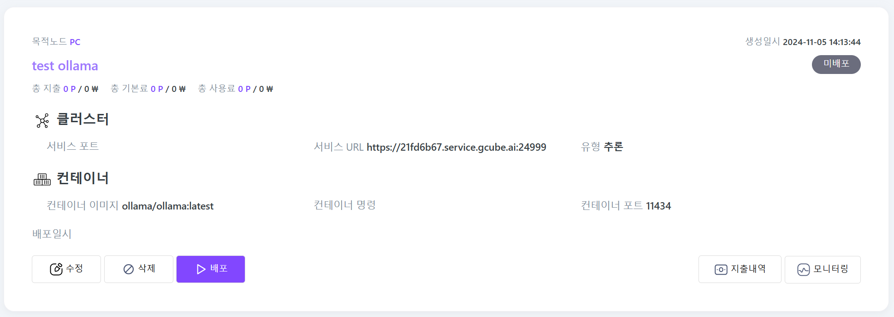

# 새 워크로드 등록

gcube의 GPU를 공유받기 위해, ‘새 워크로드 등록’이 필요합니다. 

1\. 워크로드 탭에서 “**새 워크로드 등록**” 버튼을 클릭하세요.   

2\. 워크로드 등록 페이지에 각 항목을 입력합니다.

### 설명
  

- **워크로드 설명**: 워크로드에 대한 간략한 설명을 작성합니다.

### 컨테이너
  

- **저장소 유형**: 컨테이너 이미지가 저장된 플랫폼을 선택하세요.  

- **컨테이너 이미지**: 컨테이너 이미지 URL을 입력하세요. 정확한 이미지 URL을 입력 후 우측 체크 표시를 클릭하면 녹색으로 변경되며, 컨테이너 포트가 자동으로 입력됩니다.

!!! Note
    <이미지 입력 예시> 

      - Docker Hub 공식 이미지: `pytorch/pytorch:2.0.0-cuda11.7-cudnn8-runtime`  
      - 개인 저장소 이미지: `koojy717/stable-diffusion:1.00`   

    ! 태그를 생략하면 자동으로 'latest'가 지정되나, 명시적인 태그 지정을 권장합니다.  
    ! 저장소에 존재하지 않거나 사용 불가 이미지일 경우, <ins>빨간색 체크 표시</ins>가 나타나며 컨테이너 포트 또한 입력되지 않습니다.  

 

- **컨테이너 명령**: 컨테이너가 시작될 때 실행할 명령어를 지정합니다. 컨테이너 내부에서 실행 가능한 명령어만 사용 가능합니다.
!!! Warning
    대부분의 경우, 이미지에 이미 기본 명령어가 설정되어 있으므로 비워두셔도 됩니다.  

    잘못된 명령어를 입력하면 <ins>컨테이너가 시작되지 않거나 즉시 종료</ins>될 수 있으니 주의하시기 바랍니다.

 

- **컨테이너 포트** : 컨테이너에서 사용하는 네트워크 포트입니다. 이미지 검증 시 자동으로 입력됩니다.

 

### 목적스펙
  

- **목적노드** : Tier별 공급 가능한 GPU 리소스 항목이 나타납니다.  
    - `Any` : 사용 가능한 GPU 자동 할당  
    - `Tier 1` : 클라우드 사업자  
    - `Tier 2` : 전용 서버  
    - `Tier 3` : PC방, 개인  
- **레플리카** : 배포할 컨테이너 인스턴스의 수를 지정합니다. 
- **GPU 메모리** : 필요한 GPU 메모리의 용량을 설정합니다. 설정값에 따라 사용 가능한 GPU가 필터링됩니다.  
- **GPU** : 메모리 요구사항에 맞는 사용 가능한 GPU 모델이 표시되며, 특정 모델을 선택할 수 있습니다.  

 

### 등록
  

- 총 예상 금액을 확인하고 즉시배포 여부를 선택한 후 “**등록**” 버튼을 클릭하세요.  

 
  

3\. 워크로드가 생성되어 목록에서 확인하실 수 있습니다. 

