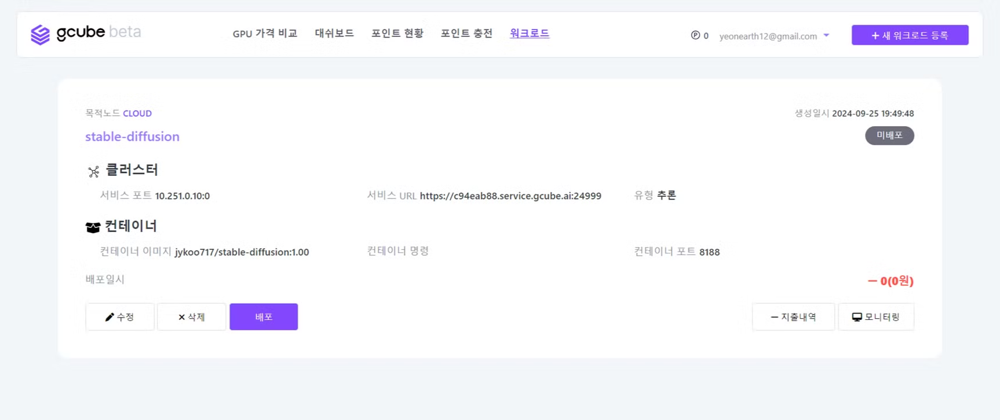

# 새 워크로드 등록

gcube의 GPU를 공유받기 위해, ‘새 워크로드 등록’이 필요합니다. 

1\. 워크로드 탭에서 “**새 워크로드 등록**” 버튼을 클릭하세요.   

2\. 워크로드의 정보를 입력한 후, “**등록**” 버튼을 클릭합니다.  

| 항목       | 설명         | 
|-------------|--------------|
| 설명     | 워크로드에 대한 간략한 설명을 작성      |
| 저장소 유형 | 컨테이너 이미지가 저장된 플랫폼을 선택         |
| 컨테이너 이미지       | 저장소에 업로드한 컨테이너 이미지 URL을 입력   *ex)* `<docker 계정>/stable-diffusion:1.00` |
| 컨테이너 명령     | 컨테이너를 실행하기 위한 초기 명령을 입력(필요 시)   *ex)* `python3 app.py`     | 
| 컨테이너 포트      | 컨테이너에서 사용하는 네트워크 포트를 입력       | 
| 목적노드 | Tier별 공급 가능한 GPU 리소스 항목이 적용   *Tier1 : 클라우드 사업자, Tier2 : 전용 서버, Tier3 : PC방, 개인*      | 
| 레플리카 | 배포할 컨테이너 인스턴스의 수를 입력      | 
| GPU 메모리   | 필요한 GPU 메모리의 양을 조정       | 
| GPU   | 사용 가능한 GPU 모델 유형을 확인 및 선택    | 

 

3\. 워크로드가 생성되어 목록에서 확인하실 수 있습니다.   