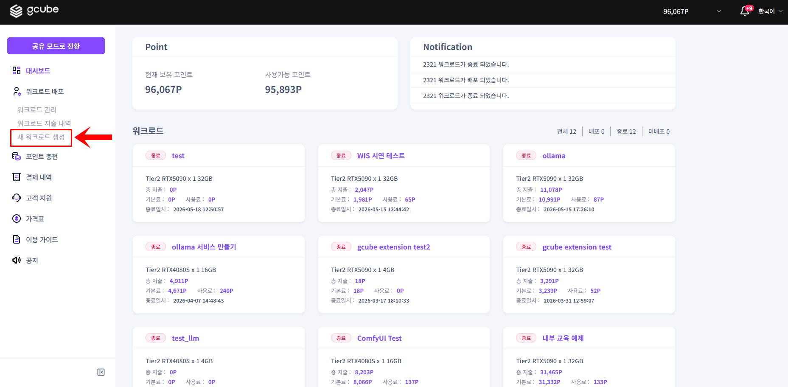
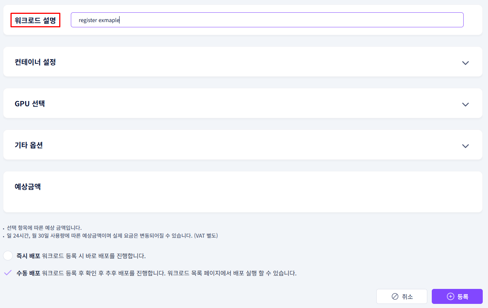
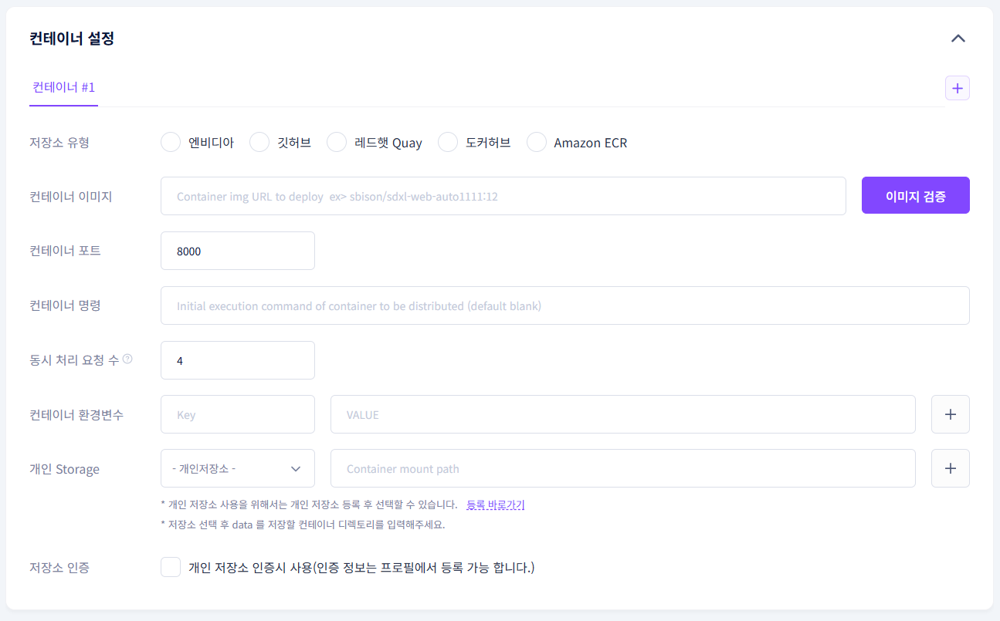
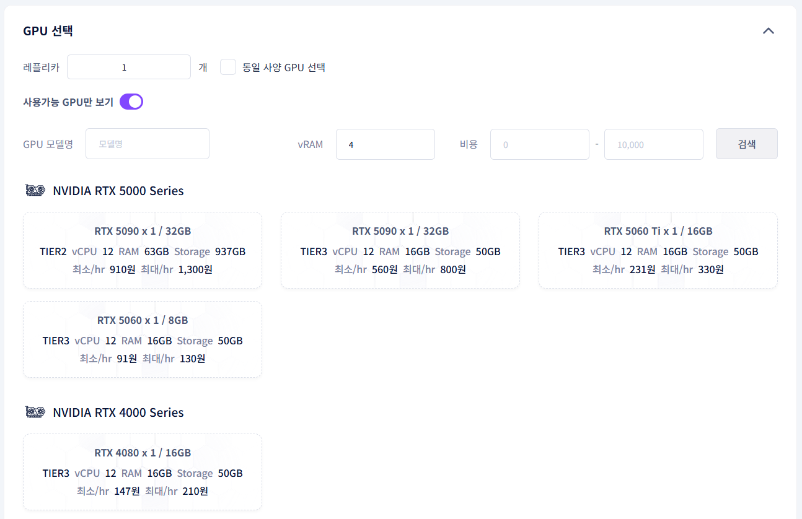
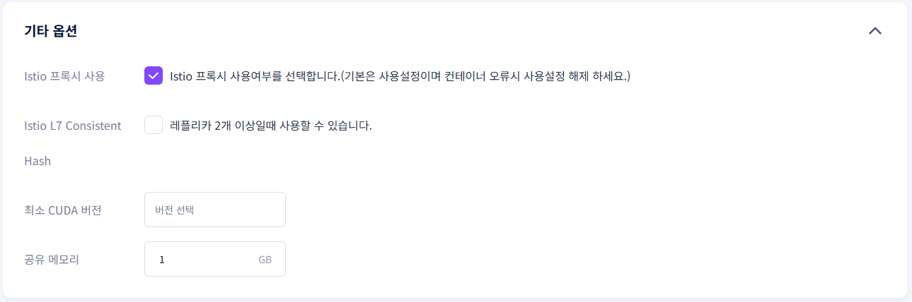
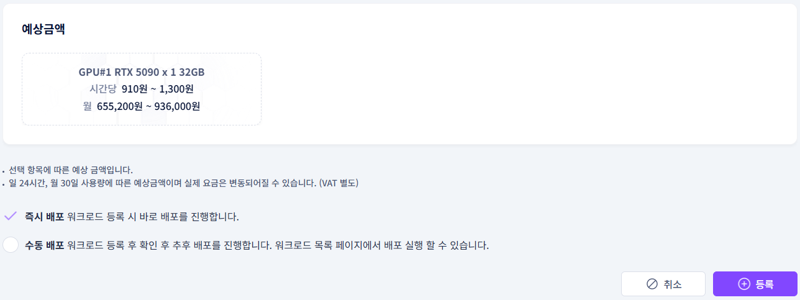

# **Register Workload**

Select a container image and GPU to register a workload.

!!! tip
    A workload is the basic unit for using GPU resources in gcube.
    Register by configuring the container image, GPU, and options.

## **Before You Begin**

- Make sure you have enough points charged.
- Have the URL of the container image you want to use ready in advance.

## **① Enter Basic Information**

1. Click New Workload Registration in the left menu of Workload Mode.

2. Enter a brief description of the workload's purpose in the description field.

## **② Container Settings**

| **Item** | **Description** |
| --- | --- |
| Registry Type | Select the platform where the container image is stored |
| Container Image | Enter the image URL for the selected registry |
| Container Port | Auto-filled after image validation |
| Container Command | Startup command when the container runs (optional) |
| Container Environment Variables | Set environment variables inside the container (optional) |
| Personal Storage | Connect a personal backup storage (optional) |
| Registry Authentication | Check if using a private registry image |

**Image URL Format by Registry**

| **Registry** | **Format** | **Example** |
| --- | --- | --- |
| Docker Hub | username/repository:tag | ollama/ollama:latest |
| NVIDIA NGC | nvcr.io/nvidia/repository:tag | nvcr.io/nvidia/cuda:12.0.0-base-ubuntu22.04 |
| GitHub | ghcr.io/owner/repository:tag | ghcr.io/organization/app:1.0 |
| Red Hat Quay | quay.io/namespace/repository:tag | quay.io/redhat/ubi8:latest |
| Hugging Face | registry.hf.space/username/repository:tag | registry.hf.space/username/model-server:v1 |

If the image URL is entered correctly, a green checkmark will appear and the port will be auto-filled. An invalid image will show a red indicator.

## **③ GPU Selection**

| **Item** | **Description** |
| --- | --- |
| GPU Model | Search and select the desired GPU model |
| GPU Memory | Set the minimum required VRAM |
| Cost | Filter by hourly minimum~maximum cost range |
| Show Available GPUs Only | Show only GPUs available for immediate use |
| Replicas | Set the number of GPUs to use |

**Tier Classification**

- Tier 1: Cloud providers
- Tier 2: Dedicated servers
- Tier 3: PC rooms, individuals

## **④ Options**

| **Item** | **Description** |
| --- | --- |
| Istio Proxy | Enable/disable proxy for container network traffic management |
| Istio L7 Consistent Hash | Route requests from the same client to the same Pod |
| Minimum CUDA Version | Specify the minimum required CUDA version |
| Shared Memory | Size of shared memory area between processes |

## **⑤ Register**

1. Confirm the estimated total cost.
2. Select whether to deploy immediately.
3. Click the Register button to create the workload.

## **Registration Example — Ollama**

!!! tip
    A basic workload registration example for running the DeepSeek model with Ollama.

| **Item** | **Value** |
| --- | --- |
| Workload Description | Run Ollama DeepSeek |
| Registry Type | Docker Hub |
| Container Image | ollama/ollama:latest |
| GPU | RTX 3090 or higher recommended (VRAM 16GB+) |
| Replicas | 1 |
| Deploy Immediately | ON |
