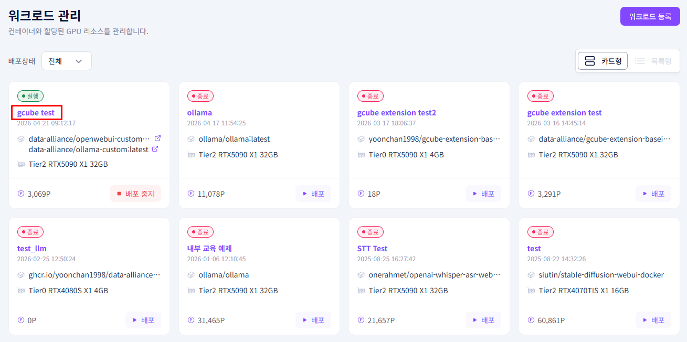
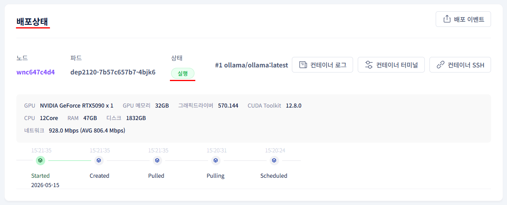
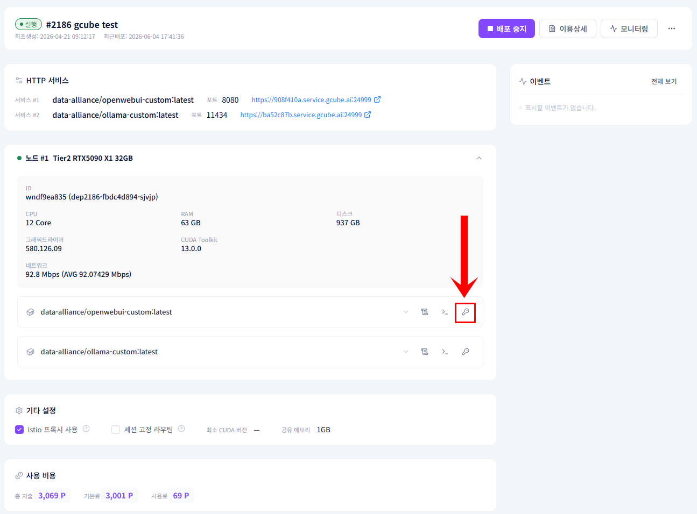
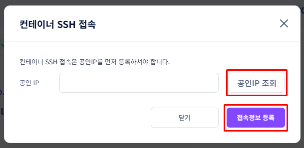
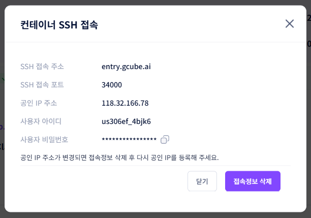
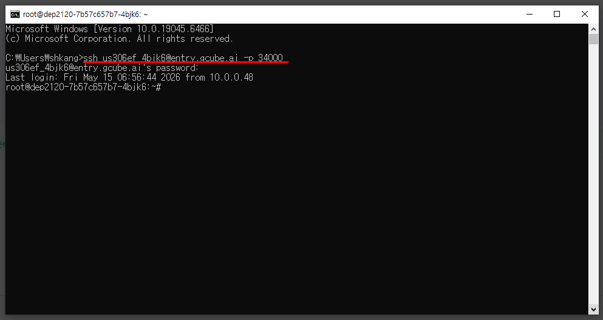
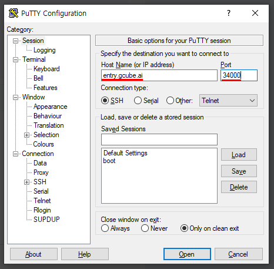
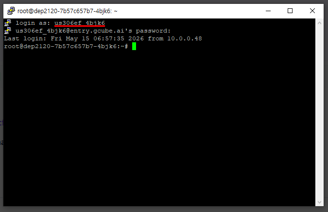

# **워크로드 SSH 터미널 접속**

배포된 워크로드의 컨테이너에 SSH로 직접 접속합니다.

!!! tip
    SSH 터미널 접속을 통해 컨테이너 내부에서 직접 명령어를 실행할 수 있습니다.<br> 모델 다운로드, 패키지 설치, 로그 확인 등 다양한 작업이 가능합니다.

---

## **시작 전 확인사항**

- 워크로드가 **배포** 상태여야 합니다.
- 아래 두 가지 접속 방법 중 하나를 선택합니다.

| 방법 | 설명 |
|---|---|
| 터미널 내장 SSH | 별도 설치 없이 사용 가능. Windows 10 build 1809 이상, macOS, Linux 지원 |
| 외부 SSH 클라이언트 | GUI 기반 프로그램으로 터미널이 익숙하지 않은 경우 사용 |

---

## **접속 정보 확인**

1. 워크로드 목록에서 접속할 워크로드를 클릭해 세부 정보로 이동합니다.

    

2. **배포 상태** 탭에서 파드 상태가 **실행**인지 확인합니다.

    

3. **컨테이너 SSH** 버튼을 클릭합니다.

    

4. 공인 IP 조희를 진행한 후, 접속 정보를 등록합니다.

    

5. SSH 접속 정보 팝업에서 아래 정보를 확인합니다.

    | 항목 | 설명 |
    |---|---|
    | SSH 접속 주소 | SSH 접속에 사용할 도메인 주소 |
    | SSH 접속 포트 | SSH 접속 포트 번호 |
    | 공인 IP 주소 | 서버 공인 IP 주소 |
    | 사용자 아이디 | SSH 로그인 계정명 |
    | 사용자 비밀번호 | SSH 로그인 비밀번호 |

    

    !!! warning
        공인 IP 주소가 변경되면 접속정보 삭제 후 다시 공인 IP를 등록해야 합니다.

---

## **SSH 접속 방법**

### **방법 1 — 터미널 내장 SSH (Windows / macOS / Linux)**

1. 터미널(명령 프롬프트, PowerShell, Terminal)을 실행하고 아래 명령어를 입력합니다.

    ```bash
    ssh [사용자 아이디]@[SSH 접속 주소] -p [SSH 접속 포트]
    ```

    예시:
    ```bash
    ssh us306ef_4bjk6@entry.gcube.ai -p 34000
    ```

2. 비밀번호를 입력하면 접속이 완료됩니다. (입력 시 화면에 표시되지 않습니다.)

    

---

### **방법 2 — 외부 SSH 클라이언트**

터미널이 익숙하지 않은 경우 GUI 기반의 외부 SSH 클라이언트를 사용할 수 있습니다.<br> 자주 사용되는 프로그램은 아래와 같습니다.

| 프로그램 | 플랫폼 | 비용 | 다운로드 |
|---|---|---|---|
| PuTTY | Windows | 무료 | [putty.org](https://www.putty.org) |
| MobaXterm | Windows | 무료 (Home Edition) | [mobaxterm.mobatek.net](https://mobaxterm.mobatek.net) |
| Bitvise SSH Client | Windows | 무료 | [bitvise.com](https://www.bitvise.com/ssh-client) |
| Termius | Windows / macOS / Linux | 무료 (Starter 플랜, 일부 기능 유료) | [termius.com](https://termius.com) |

!!! note "PuTTY 접속 예시"
    1. PuTTY를 실행합니다.
    2. **Host Name**에 SSH 접속 주소(예: `entry.gcube.ai`)를 입력하고 **Port**에 SSH 접속 포트(예: `34000`)를 입력합니다.
    3. Connection type을 **SSH**로 선택 후 **Open**을 클릭합니다.
    4. `login as:` 에 사용자 아이디, 이어서 비밀번호를 입력합니다. (비밀번호 입력 시 화면에 표시되지 않습니다.)

    

    

---

## **접속 후 활용 예시**

| 작업 | 명령어 예시 |
|---|---|
| AI 모델 다운로드 | `ollama pull deepseek-r1:8b` |
| 패키지 설치 | `pip install [패키지명]` |
| 컨테이너 로그 확인 | `tail -f /var/log/[서비스명].log` |
| GPU 상태 확인 | `nvidia-smi` |
| 프로세스 확인 | `ps aux` |

!!! warning
    SSH 접속 정보(비밀번호)는 외부에 공유하지 마세요. 워크로드 재배포 시 접속 정보가 변경될 수 있습니다.
