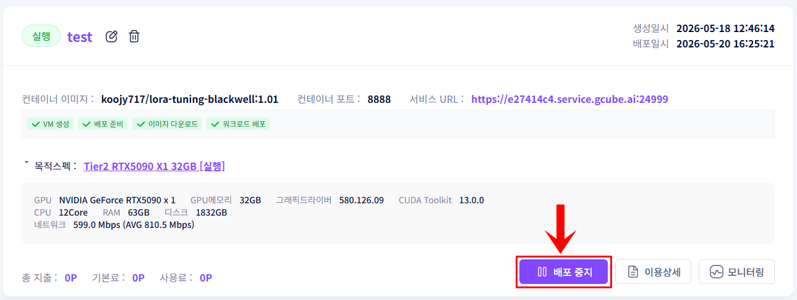
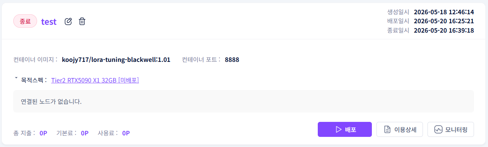

# **워크로드 종료**

배포된 워크로드를 중단합니다.

!!! tip
    워크로드를 종료하면 포인트 차감이 중단됩니다. 
    종료 전 데이터 저장 여부를 반드시 확인하세요.

!!! warning
    백업 저장소를 설정하지 않은 경우 종료 시 작업 중이던 데이터와 환경이 모두 삭제됩니다. 
    사전에 저장소 관리에서 개인 Storage를 설정하세요.

## **종료 방법**

1. 워크로드 목록에서 종료할 항목의 배포중지 버튼을 클릭합니다.

1. 확인 팝업에서 확인 버튼을 클릭합니다.
2. 워크로드 상태가 배포 → 종료로 변경되며 서비스가 중단됩니다.

## **종료 후 데이터 보존 방법**

워크로드 종료 후에도 데이터를 보존하려면 사전에 개인 Storage를 연결하고 워크로드 등록 시 설정해야 합니다.

- 저장소 관리 → 백업 데이터 개인 저장소 연결 등록
- 워크로드 등록 시 → 개인 Storage 항목에서 해당 저장소 선택

---

[AI 모델 실행하기 →](../platform-guide/ollama-api.ko.md){ .md-button .md-button--primary }
[GPU 공유하기 →](../node/node-dashboard.ko.md){ .md-button }

