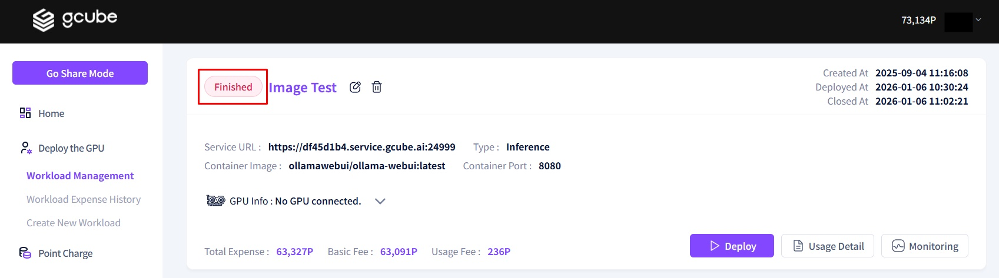

# **Terminate Workload**

To stop a workload, click the **'Stop'** button.   

1\.To terminate a workload, click the 'Stop' button on the deployed item, then click 'Confirm'.   

2\. The workload status in the top right changes from **'Running'** to **'Finished'**, and the service is discontinued.   

<aside>
⚠️ 

Please note that if a backup storage is not configured, your work data and environment will not be saved upon termination. (Data can be saved if you have configured personal storage settings when creating a workload after setting up the link in <b>Storage Management > Backup Data Personal Storage.</b>)

</aside>