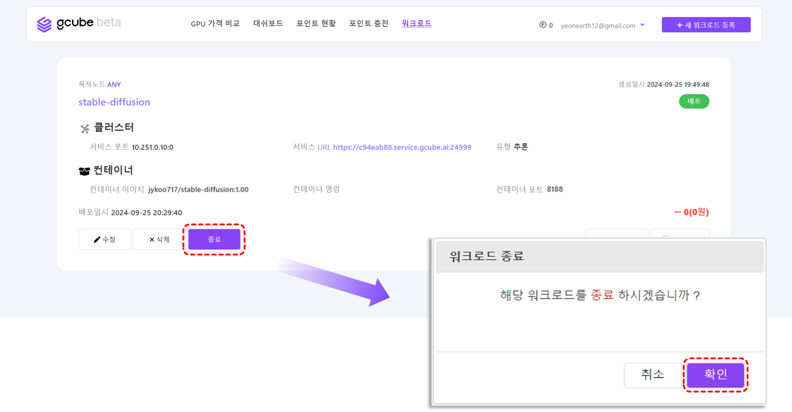
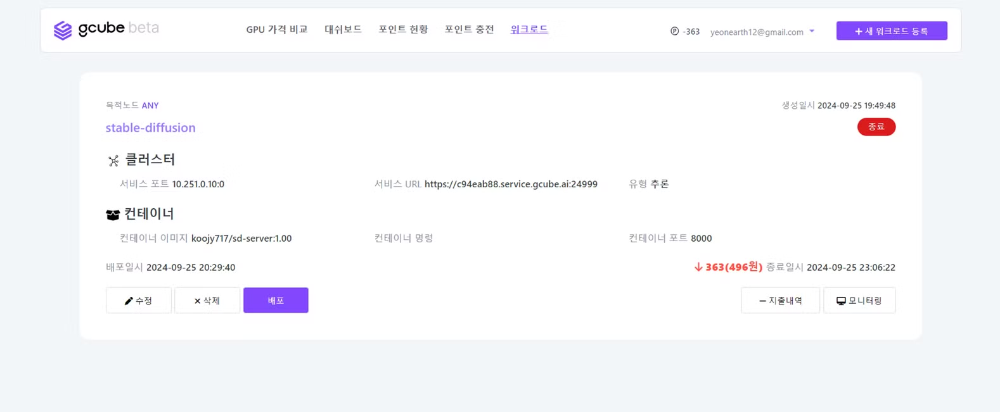

# 워크로드 종료

워크로드는 ‘종료’ 버튼을 통해 사용을 중단할 수 있습니다.  

1\. 워크로드 종료를 원하신다면, 배포된 항목의 “**종료**” 버튼을 클릭 후, “**확인**” 버튼을 클릭하세요.   

2\. 우측 상단의 워크로드 상태가 **배포** → **종료** 상태로 변경되며, 서비스가 중단됩니다. 

!!! Note  
      종료 시, 작업 중이던 데이터 및 환경은 **저장되지 않으니** 유의하시기 바랍니다.   
      (향후 외부 스토리지를 이용하여 저장할 수 있도록 업데이트 할 예정입니다.)
