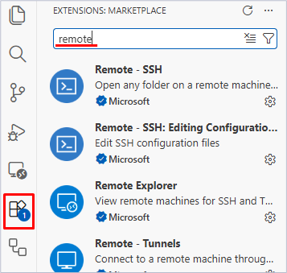
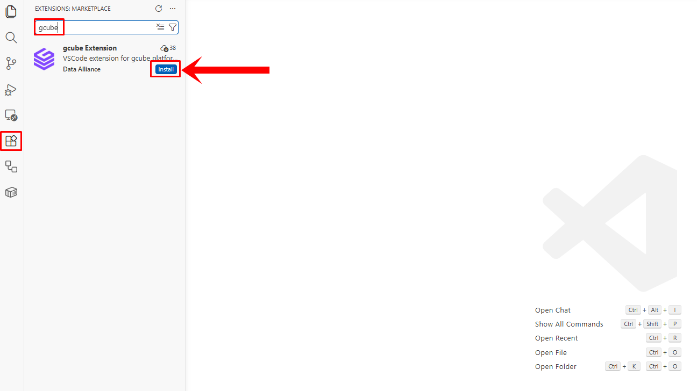
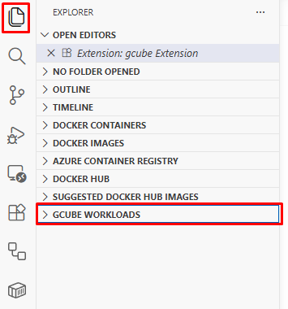
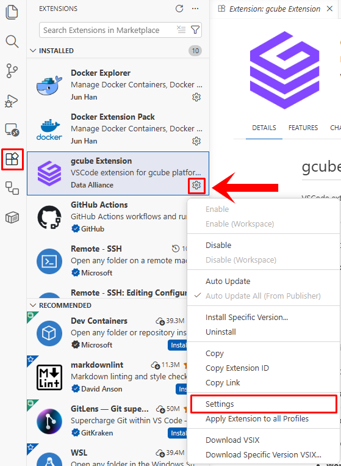
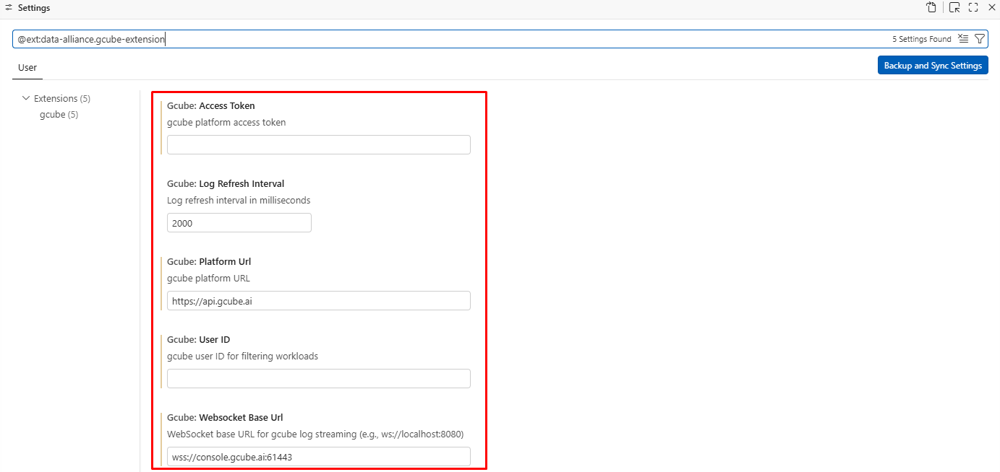
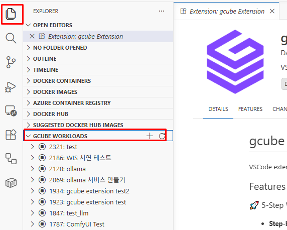

# **워크로드 VS Code 익스텐션 접속**

VS Code에서 gcube 익스텐션을 사용해 워크로드 컨테이너에 원격 접속합니다.

!!! tip
    gcube VS Code 익스텐션을 사용하면 로컬 VS Code 환경에서 gcube 워크로드 컨테이너에 직접 접속해<br> 파일 편집, 코드 실행, 디버깅을 진행할 수 있습니다.

---

## **실행 흐름 요약**

```
VSCode → gcube Extension → Platform API → GPU 워크로드 생성 → Pod 실행
```

| 단계 | 설명 |
|---|---|
| 1단계 | 개발자가 VSCode의 gcube Extension을 통해 gcube Platform에 Tunnel Setup을 요청합니다. |
| 2단계 | gcube Platform이 GPU Node 위에 Pod를 생성하고 VSCode Server를 설치 및 Tunnel을<br> 구성합니다. |
| 3단계 | Pod 내 VSCode Server가 준비되면 인증에 필요한 Auth URL과 Code를 gcube Extension으로<br> 전달합니다. |
| 4단계 | GitHub 인증이 완료되면 VSCode Server ↔ VSCode Tunnel ↔ GitHub Site 간의 Tunnel이<br> 설정됩니다. |
| 5단계 | 개발자는 로컬 VSCode에서 VSCode Tunnel을 통해 원격 Pod 환경에 접속합니다. |

---

## **시작 전 확인사항**

- 워크로드가 **배포** 상태여야 합니다.
- 아래 준비 사항을 모두 완료한 후 진행하세요.

---

## **1단계 — 필수 계정 준비**

### GitHub 계정

아래 역할을 위해 필요합니다.

- Git Repository 생성
- GitHub Actions 실행
- GHCR(GitHub Container Registry) 이미지 등록
- GitHub PAT 토큰 발급

!!! note "GitHub PAT 발급 스코프"
    classic 방식으로 발급하며 아래 스코프를 체크합니다: `repo`, `workflow`, `write:packages`, `delete:packages`

### gcube 계정

아래 역할을 위해 필요합니다.

- 워크로드 생성
- GPU 자원 할당
- Pod 접속 및 실행
- 서비스 URL 생성

!!! note
    gcube Access Token은 gcube 홈페이지의 내 프로필에서 [GCUBE 엑세스 토큰](https://gcube.ai/ko/demand/user/access-token)에서 발급받으실 수 있습니다.

---

## **2단계 — Visual Studio Code 설치**

[VS Code 공식 사이트](https://code.visualstudio.com/)에서 설치합니다.

- 최신 버전 사용 권장 (최소 버전: 1.96.0)
- 설치 완료 후 Extensions 메뉴 접근 가능 여부를 확인합니다.

---

## **3단계 — 필수 Extension 설치**

gcube Extension 정상 동작을 위해 아래 Extension을 먼저 설치합니다.

| Extension 이름 | 제공사 | 버전 |
|---|---|---|
| Remote - SSH | Microsoft | 0.120.0 |
| Remote - Tunnels | Microsoft | 1.5.2 |
| Remote Explorer | Microsoft | 0.5.0 |
| Container Tools | Microsoft | 2.1.0 |
| Docker Extension Pack | Jun Han | 0.0.1 |

**설치 방법:**

1. VSCode 좌측 **Extensions** 아이콘을 클릭합니다.
2. Extension 이름을 검색합니다.
3. **Install** 버튼을 클릭합니다.



!!! note
    설치가 완료되면 VSCode 재시작을 권장합니다.

---

## **4단계 — gcube Extension 설치**

1. VSCode Extensions 검색창에 `gcube`를 입력합니다.
2. **gcube Extension** (제공사: Data Alliance)을 찾아 **Install** 버튼을 클릭합니다.

    

3. 설치가 완료되면 좌측 Explorer 영역에 **GCUBE WORKLOADS** 메뉴가 표시됩니다.

    

---

## **5단계 — gcube Extension 설정**

Extension 설치 후 gcube 플랫폼과 연결되도록 초기 설정을 진행합니다.

**설정 경로:** Extensions → gcube Extension → **Manage** 버튼 클릭 → **Settings** 선택



아래 항목을 정확히 입력합니다.

| 항목 | 입력값 |
|---|---|
| gcube User ID | gcube 개인 ID |
| gcube Access Token | 관리자 발급 토큰 |
| gcube Platform URL | `https://api.gcube.ai` |
| gcube Websocket Base URL | `wss://console.gcube.ai:61443` |
| Log Refresh Interval | `2000` |



!!! warning
    항목을 정확히 입력해야 정상 연결이 이루어집니다. Access Token은 홈페이지 [GCUBE 엑세스 토큰](https://gcube.ai/ko/demand/user/access-token)에서 발급받으세요.

---

## **6단계 — 설정 완료 확인**

설정이 정상적으로 완료되면 **GCUBE WORKLOADS** 영역에 기존 워크로드 목록이 표시됩니다.



목록이 보이지 않는다면 아래 표를 참고해 설정을 다시 확인하세요.

| 문제 | 원인 |
|---|---|
| 워크로드 목록이 보이지 않음 | Access Token 오류 |
| 연결 실패 메시지 | Platform URL 오타 |
| Remote 항목 미표시 | Remote - Tunnels 미설치 |
