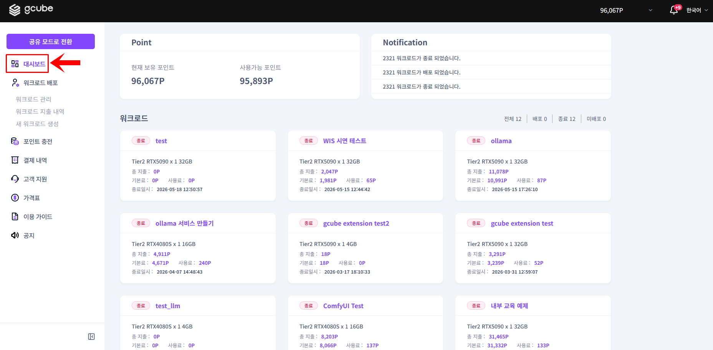
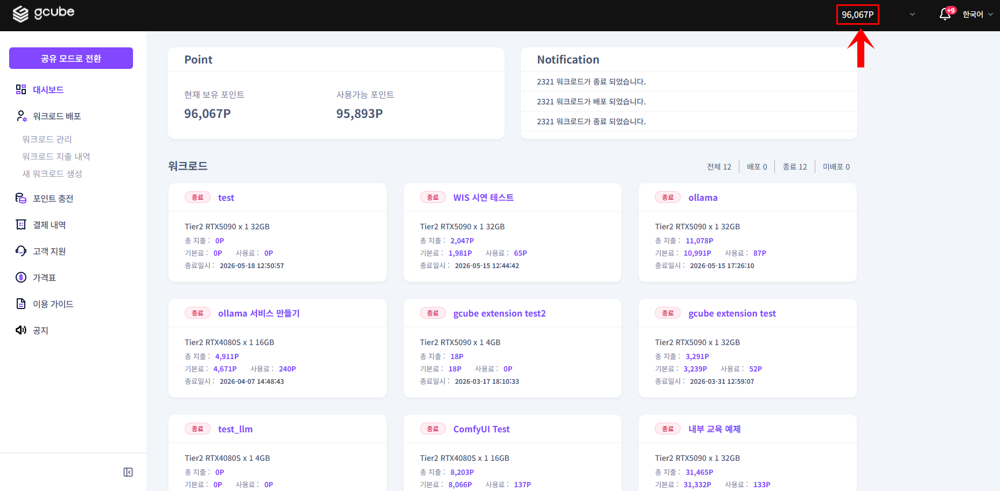
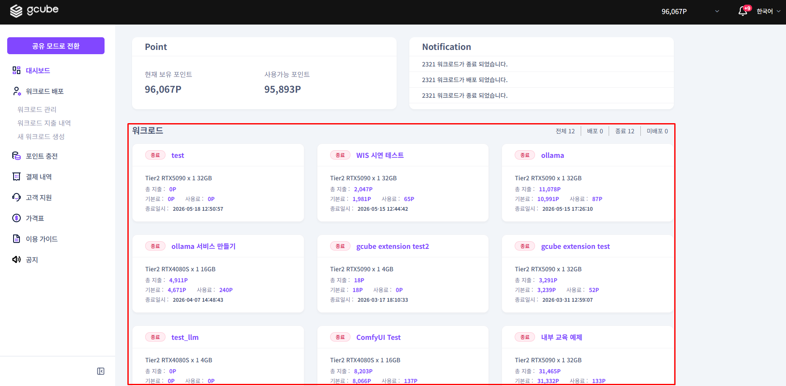

# **Workload Dashboard**

Check your available points and the status of your running workloads.

!!! tip
    The Workload Dashboard is the first screen in Workload Mode.
    You can check your point balance and all workload statuses in one place.

## **Available Information**

| **Item** | **Description** |
| --- | --- |
| Available Points | Current usable point balance |
| Workload Overview | Summary of all created workloads |
| Workload Details | Click individual workloads to view detailed information |

## **How to Use the Dashboard**

1. In Workload Mode, click Dashboard in the left menu.

2. Check your available points at the top. Recharge if your balance is low.

3. Check the operation status of each workload in the workload list.

!!! warning
    If no workloads are displayed, you have not registered a workload yet.
    Follow the next steps below to start registration.
