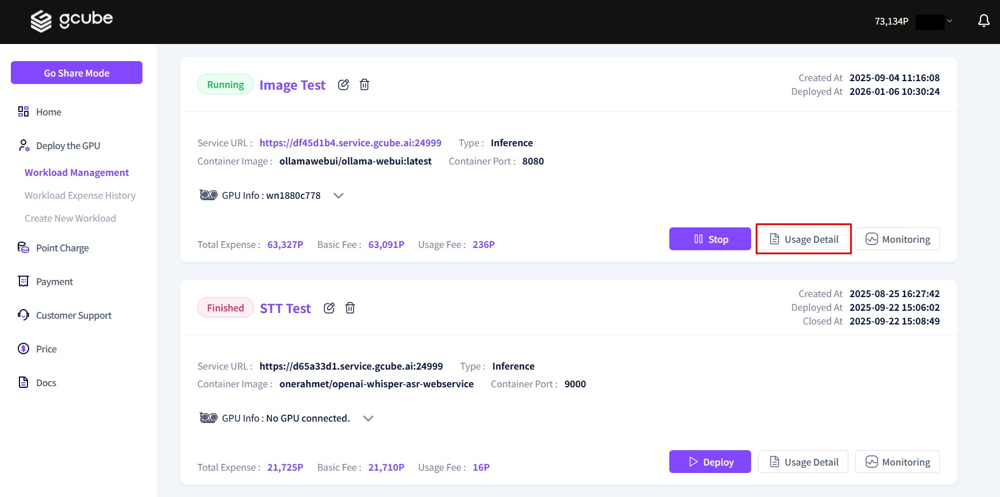
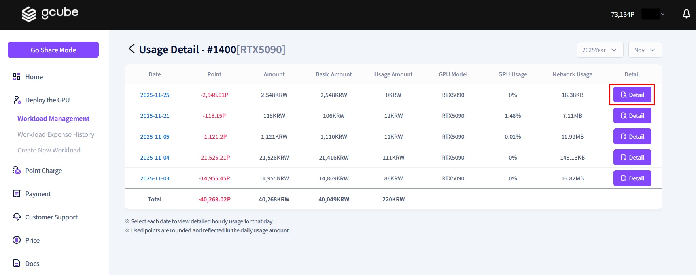
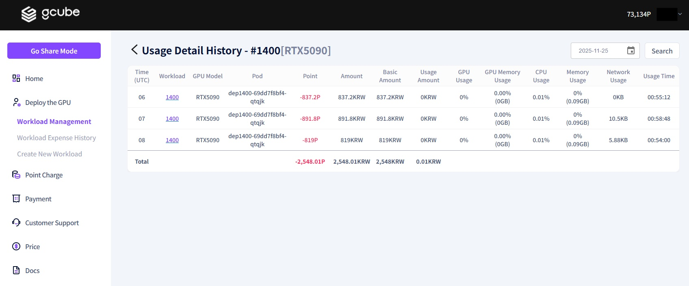

# **Workload Usage History**

You can check the detailed breakdown of points consumed based on your workload activity through the **"Usage Details"** feature.   

1\. Click the **'Usage Details'** button located at the bottom right of the workload item.   

2\. You can check the points consumed and the total usage fees for each workload item.   

3\. By clicking the **'Details'** button, you can check the granular billing breakdown by individual pod or usage duration.