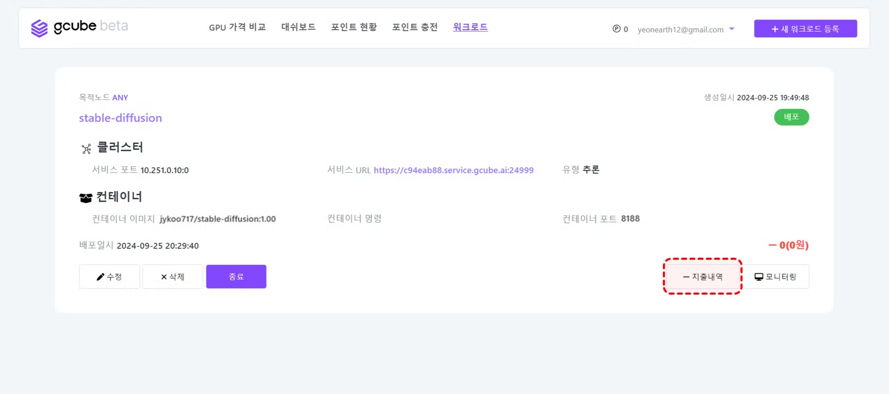
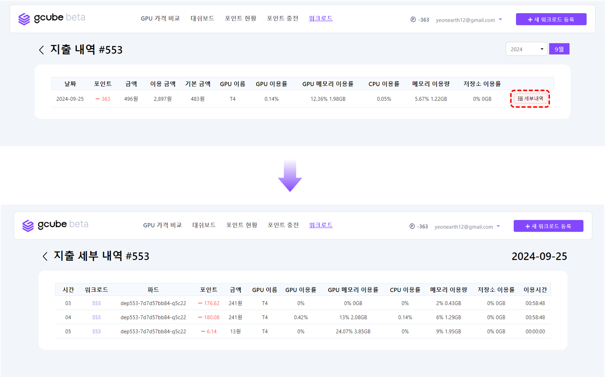

# 워크로드 지출내역

워크로드 사용에 따른 지출내역은 ‘지출내역’ 기능을 통해 확인할 수 있습니다. 

1\. 워크로드 항목 우측 하단의 “**지출내역**” 버튼을 클릭합니다.   

2\. 워크로드 항목에 대한 사용 포인트 및 이용 금액을 확인할 수 있습니다.  
**“세부내역”** 버튼을 클릭하면 파드나 이용시간별로 과금된 세부 내역을 확인하실 수 있습니다.   