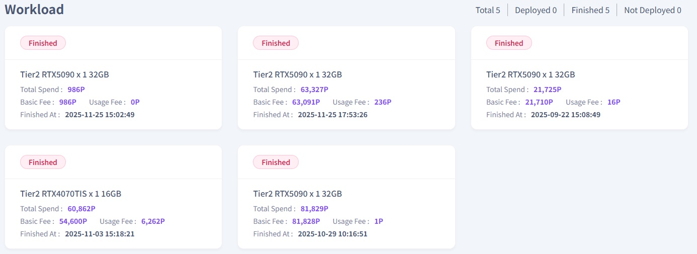

# **Home**

The Home menu allows you to monitor the overall cluster status of the current workloads.  

1\. By clicking the **"Home"** menu on the left sidebar, you can view your total earned points, along with a summary and real-time status of your active workloads.  

2\. You can view the overall operational summary of your created workloads, and by clicking on an individual workload description, you can access detailed information for each specific task.