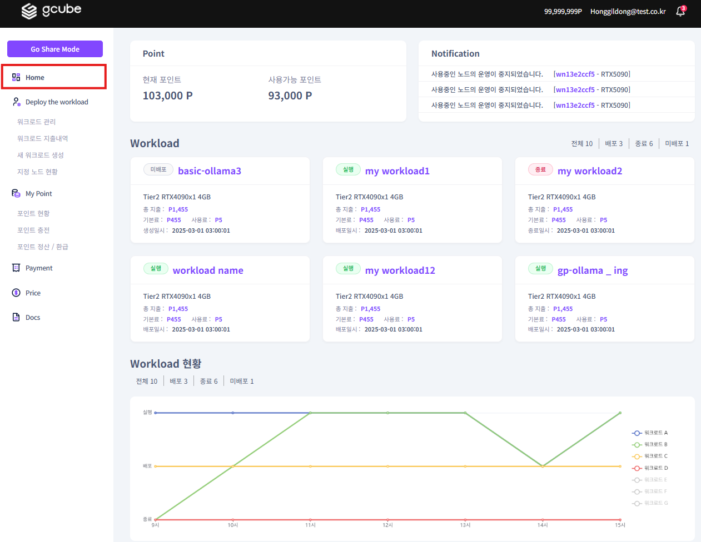
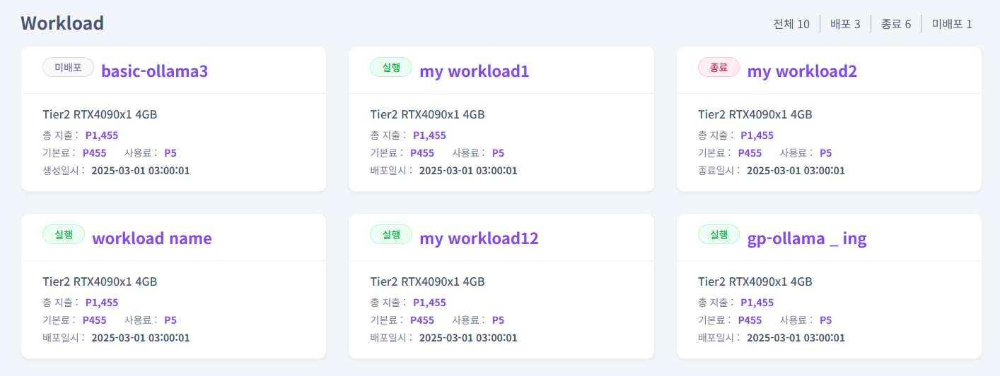

# **Home**

Home 메뉴는 워크로드의 클러스터 전체 현황을 확인할 수 있습니다.  

1\. 좌측 메뉴에서 **“Home”** 메뉴를 클릭하면 보유 포인트 금액과 운영중인 워크로드의 요약 정보와 현황들을 확인하실 수 있습니다.   

2\. 생성한 워크로드의 전체 요약 운영 현황과 함께 개별 워크로드 설명을 클릭하면 워크로드별 상세 정보를 확인하실 수 있습니다.