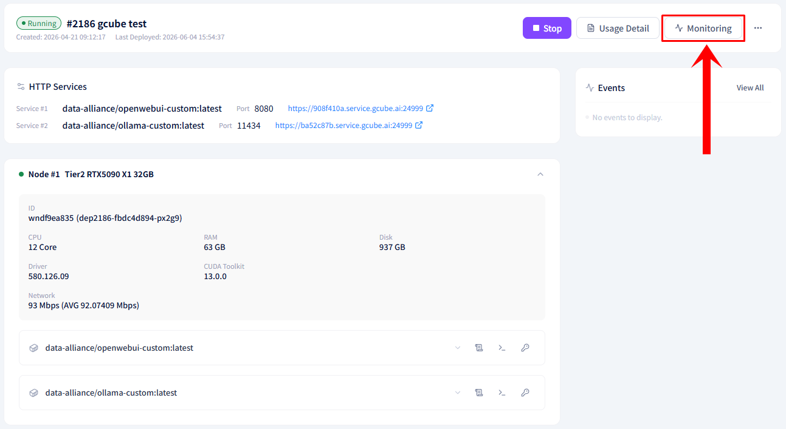
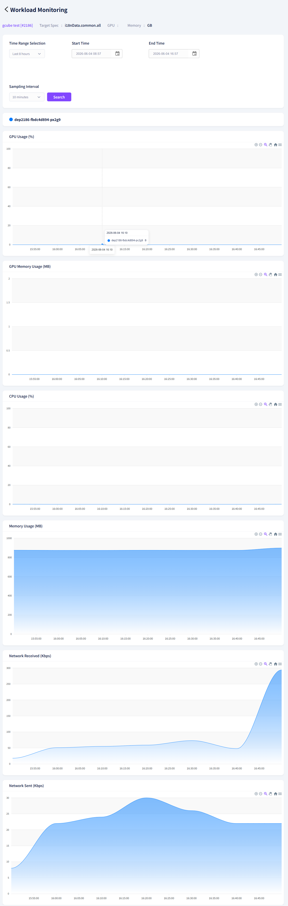

# **Monitoring**

Check real-time GPU, CPU, and network usage of your deployed workload.

!!! tip
    Monitoring only displays real-time data when the workload is in Deployed status.

## **How to Access Monitoring**

1. Click the Monitoring button at the bottom right of the workload item in the workload list.

2. The real-time monitoring screen will be displayed.

## **Available Metrics**

| **Metric** | **Unit** |
| --- | --- |
| GPU Usage | % |
| GPU Memory Usage | MB |
| CPU Usage | % |
| Memory Usage | MB |
| Network Packets Received | Kbps |
| Network Packets Sent | Kbps |

---

[Next: Check Usage History →](check-usage.en.md){ .md-button .md-button--primary }

