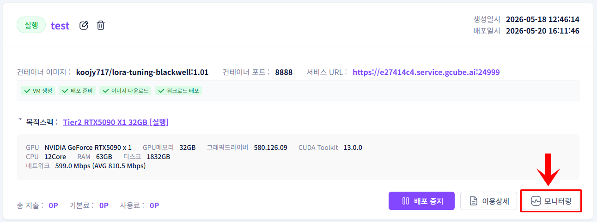
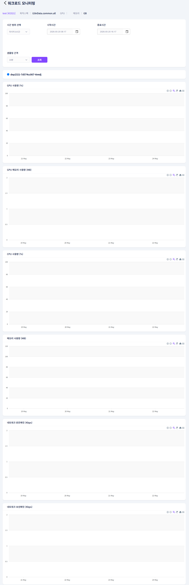

# **모니터링**

배포된 워크로드의 실시간 GPU·CPU·네트워크 사용량을 확인합니다.

!!! tip
    모니터링은 워크로드가 배포 상태일 때만 실시간 데이터가 표시됩니다.

## **모니터링 진입 방법**

1. 워크로드 목록에서 모니터링할 항목 우측 하단의 모니터링 버튼을 클릭합니다.

1. 실시간 모니터링 화면이 표시됩니다.

## **확인 가능한 지표**

| **지표** | **단위** |
| --- | --- |
| GPU 사용량 | % |
| GPU 메모리 사용량 | MB |
| CPU 사용량 | % |
| 메모리 사용량 | MB |
| 네트워크 받은 패킷 | Kbps |
| 네트워크 보낸 패킷 | Kbps |
